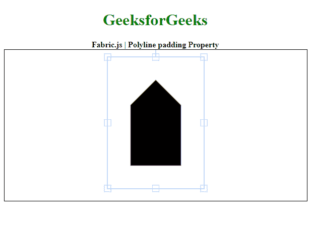

# 织物. js 折线填充属性

> 原文:[https://www . geesforgeks . org/fabric-js-polyline-padding-property/](https://www.geeksforgeeks.org/fabric-js-polyline-padding-property/)

在本文中，我们将看到如何使用 **FabricJS** 更改画布折线的填充。画布折线意味着它是可移动的，可以根据需要拉伸。此外，当涉及初始笔画颜色、高度、宽度、填充颜色或笔画宽度时，可以自定义折线。

为了实现这一点，我们将使用一个名为 **FabricJS** 的 JavaScript 库。导入库后，我们将在包含折线的主体标记中创建一个画布块。之后，我们将初始化由**fabrijs**提供的画布和折线实例，并使用填充属性更改折线的填充，并在画布上渲染折线，如下例所示。

**语法:**

```
var polyline = new fabric.Polyline(
    points,
    {
        padding: number
    }
)

```

**参数:**该属性接受两个参数，如上所述，如下所述:

*   **点:**保存折线所有点的起点和终点坐标。
*   **填充:**指定控制边框和画布折线之间的填充。

以下示例说明了 JavaScript 中的**折线填充属性**:

**示例:**

## java 描述语言

```
<!DOCTYPE html>
<html>

<head>
    <!-- Loading the FabricJS library -->
    <script src=
"https://cdnjs.cloudflare.com/ajax/libs/fabric.js/3.6.2/fabric.min.js">
    </script>
</head>

<body>
    <div style="text-align:
        center;width: 600px;">
        <h1 style="color: green;">
            GeeksforGeeks
        </h1>
        <b>
            Fabric.js | Polyline padding Property
        </b>
    </div>

    <canvas id="canvas" width="600" height="300" 
        style="border:1px solid #000000;">
    </canvas>

    <script>

        // Initiate a Canvas instance 
        var canvas = new fabric.Canvas("canvas");

        // Initiate a Polyline instance 
        var polyline = new fabric.Polyline([
            {
                x: 300,
                y: 60
            }, {
                x: 350,
                y: 110
            }, {
                x: 350,
                y: 230
            }, {
                x: 250,
                y: 230
            }, {
                x: 250,
                y: 110
            }, {
                x: 300,
                y: 60
            }], {

            // Specify the padding to be used
            padding: 45
        });

        // Render the Polyline in canvas 
        canvas.add(polyline); 
    </script>
</body>

</html>
```

**输出:**

