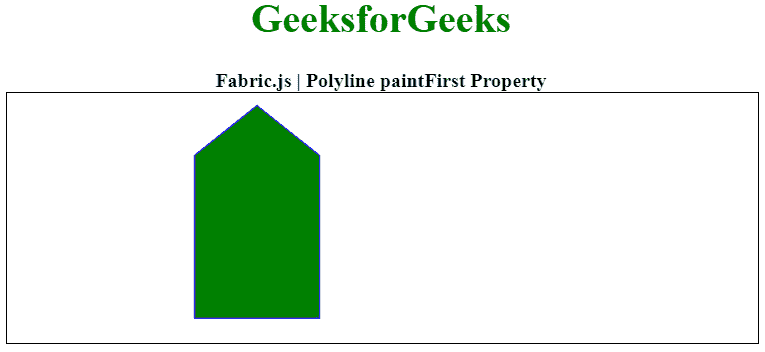

# Fabric.js 折线绘制第一属性

> 原文:[https://www . geesforgeks . org/fabric-js-polyline-paint first-property/](https://www.geeksforgeeks.org/fabric-js-polyline-paintfirst-property/)

在本文中，我们将使用 FabricJS 查看折线画布的 paintFirst 属性。画布折线意味着折线是可移动的，可以根据需要拉伸。此外，在初始描边颜色、高度、宽度、填充颜色或描边宽度方面，可以自定义折线。

为了实现这一点，我们将使用一个名为 FabricJS 的 JavaScript 库。导入库后，我们将在包含折线的主体标记中创建一个画布块。之后，我们将初始化由 FabricJS 提供的画布和折线实例，并使用 paintFirst 属性设置画布折线的 paintFirst，并在画布上渲染折线，如下例所示。

**语法:**

```
var polyline = new fabric.Polyline(Points, {  
   paintFirst : boolean
  });  
```

**参数:**该属性接受如上所述的单个参数，如下所述:

*   **画图优先:**它定义首先绘制填充或描边(填充或描边之一)

下面的例子说明了 Fabric.js 中的 paintFirst 属性:

**示例:**

## 超文本标记语言

```
<!DOCTYPE html> 
<html> 
  <head> 
    <!-- Loading the FabricJS library -->
    <script src= 
"https://cdnjs.cloudflare.com/ajax/libs/fabric.js/3.6.2/fabric.min.js"> 
    </script> 
  </head> 

  <body> 
    <div style="text-align: center;width: 600px;"> 
      <h1 style="color: green;"> 
        GeeksforGeeks 
      </h1> 
      <b> 
        Fabric.js | Polyline paintFirst Property 
      </b> 
    </div> 
    <canvas id="canvas"
            width="600"
            height="200"
            style="border:1px solid #000000;"> 
    </canvas> 

    <script> 

      // Initiate a Canvas instance 
      var canvas = new fabric.Canvas("canvas"); 

      // Initiate a polyline instance 
      var polyline = new fabric.Polyline([ 
        { x: 200, y: 10 },{x: 250,y: 50}, 
        { x: 250, y: 180},{x: 150,y: 180}, 
        { x: 150, y: 50 },{ x: 200,y: 10 }],
      { 
        fill:'green',
        stroke: 'blue',
        paintFirst: 'fill' 
      }); 

      // Render the polyline in canvas 
      canvas.add(polyline); 
    </script> 
  </body> 
</html>
```

**输出:**

