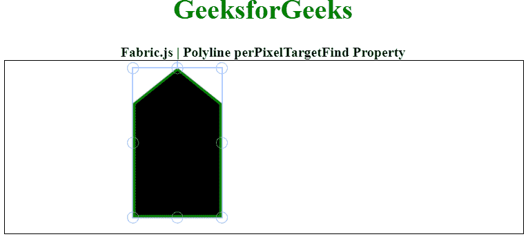

# Fabric.js 折线 perPixelTargetFind 属性

> 原文:[https://www . geesforgeks . org/fabric-js-polyline-perpixel targetfind-property/](https://www.geeksforgeeks.org/fabric-js-polyline-perpixeltargetfind-property/)

在本文中，我们将使用 **FabricJS** 来查看折线画布的 *perPixelTargetFind* 属性。画布折线是可移动的，可以根据需要进行拉伸。此外，折线可以在初始*笔画颜色、高度、宽度、填充颜色、*或*笔画宽度时进行自定义。*

为了实现这一点，我们将使用一个名为 **FabricJS** 的 JavaScript 库。导入库后，我们将在包含折线的主体标记中创建一个画布块。之后，我们将初始化由**fabrijs**提供的画布和折线实例，并使用 *perPixelTargetFind* 属性设置画布折线的 *perPixelTargetFind* ，并在画布上渲染折线，如下例所示。

**语法:**

```
var polyline = new fabric.Polyline(Points, {  
            perPixelTargetFind :Boolean
   });  
```

**参数:**该属性接受一个参数，如上所述，如下所述。

*   **perPixelTargetFind:** 当设置为 *true* 时，对象是基于每个像素而不是根据边界框在画布上找到的。

以下示例说明了**织物. js.** 中的*左侧*属性

**示例:**

## 超文本标记语言

```
<!DOCTYPE html> 
<html> 
<head> 

    <!-- Loading the FabricJS library -->
    <script src= 
"https://cdnjs.cloudflare.com/ajax/libs/fabric.js/3.6.2/fabric.min.js"> 
    </script> 
</head> 

<body> 
        <div style="text-align: center;width: 600px;"> 
        <h1 style="color: green;"> 
            GeeksforGeeks 
        </h1> 
        <b> 
            Fabric.js | Polyline perPixelTargetFind Property 
        </b> 
        </div> 
    <canvas id="canvas"
            width="600"
            height="200"
            style="border:1px solid #000000;"> 
    </canvas> 

    <script> 

        // Initiate a Canvas instance 
        var canvas = new fabric.Canvas("canvas"); 

        // Initiate a polyline instance 
        var polyline = new fabric.Polyline([ 
        { x: 200, 
            y: 10 }, 
        {x: 250, 
            y: 50 
        }, { 
            x: 250, 
            y: 180 
        }, { 
            x: 150, 
            y: 180 
        }, { 
            x: 150, 
            y: 50 
        }, { 
            x: 200, 
            y: 10 }], { 
            stroke: 'green',  
            strokeWidth: 3,  
            cornerStyle: 'circle',  
            perPixelTargetFind: true  

        }); 

        // Render the polyline in canvas 
        canvas.add(polyline); 
    </script> 
</body> 

</html>
```

**输出:**

