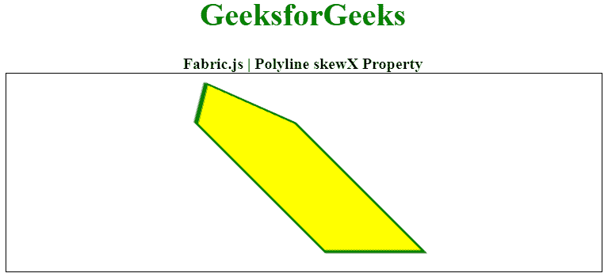

# Fabric.js 折线倾斜属性

> 原文:[https://www . geesforgeks . org/fabric-js-polyline-skew x-property/](https://www.geeksforgeeks.org/fabric-js-polyline-skewx-property/)

在本文中，我们将看到如何使用 Fabric.js 设置画布折线的水平歪斜。Fabric.js 中的折线是可移动的，并且可以根据需求进行拉伸。此外，当涉及到初始笔画颜色、高度、宽度、填充颜色或笔画宽度时，可以自定义折线。

为了实现这一点，我们将使用一个名为 Fabric.js 的 JavaScript 库。导入库后，我们将在主体标签中创建一个包含折线的画布块。之后，我们将初始化 Fabric.js 提供的 Canvas 和 Polyline 的实例，使用 skewX 属性设置折线的水平倾斜，并在 Canvas 上渲染折线，如下例所示。

**语法:**

```
var polyline = new fabric.Polyline(Points, {  
    skewX: number
});  
```

**参数:**该属性接受如上所述的单个参数，如下所述:

*   **偏斜:**指定水平偏斜角度，单位为度。

下面的例子说明了 Fabric.js 中的 skewX 属性:

**示例:**

## 超文本标记语言

```
<html>
<head>
  <!-- Loading the FabricJS library -->
  <script src=
"https://cdnjs.cloudflare.com/ajax/libs/fabric.js/3.6.2/fabric.min.js">
  </script>
</head>
<body>
  <div style="text-align: center;width: 600px;">
    <h1 style="color: green;">
      GeeksforGeeks
    </h1>
    <b>
      Fabric.js | Polyline skewX Property
    </b>
  </div>
  <canvas id="canvas" width="600" height="200"
          style="border:1px solid #000000;">
  </canvas>
  <script>

    // Initiate a Canvas instance 
    var canvas = new fabric.Canvas("canvas");

    // Initiate a polyline instance 
    var polyline = new fabric.Polyline([
      {
        x: 200,
        y: 10
      }, {
        x: 250,
        y: 50
      }, {
        x: 250,
        y: 180
      }, {
        x: 150,
        y: 180
      }, {
        x: 150,
        y: 50
      }, {
        x: 200,
        y: 10
      }], {
      stroke: 'green',
      strokeWidth: 3,
      fill: 'yellow',
      skewX: 45
    });

    // Render the polyline in canvas 
    canvas.add(polyline); 
  </script>
</body>
</html>
```

**输出:**

