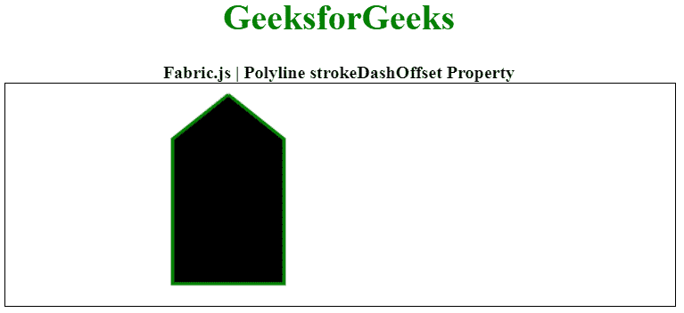

# Fabric.js 折线 strokeDashOffset 属性

> 原文:[https://www . geesforgeks . org/fabric-js-polyline-strokedashoffset-property/](https://www.geeksforgeeks.org/fabric-js-polyline-strokedashoffset-property/)

在本文中，我们将看到如何使用 **FabricJS** 将**笔划** **偏移**添加到**折线**画布上。画布意味着编写的折线是可移动的、可旋转的、可调整大小的，并且可以拉伸。但是在本文中，我们将添加一个笔画偏移。此外，折线本身不能像文本框一样编辑。

为了实现这一点，我们将使用一个名为 FabricJS 的 JavaScript 库。使用 CDN 导入库后，我们将在主体标签中创建一个画布块，它将包含我们的折线。之后，我们将初始化 FabricJS 提供的 Canvas 和 Polyline 的实例，并使用 stroke 属性创建一个笔划，并进一步使用 strokeDashOffset 属性添加笔划偏移，并在 Polyline 上渲染 Canvas，如下例所示。

**语法:**

```
var polyline = new fabric.Polyline(Points, {  
    strokeDashOffset: number
  });  
```

**参数:**该属性接受如上所述的单个参数，如下所述:

*   **冲程偏移量:**该参数定义冲程的偏移量。

下面的例子说明了 Fabric.js 中的 strokeDashOffset 属性:

**示例:**

## 超文本标记语言

```
<!DOCTYPE html> 
<html> 
  <head> 
    <!-- Loading the FabricJS library -->
    <script src= 
"https://cdnjs.cloudflare.com/ajax/libs/fabric.js/3.6.2/fabric.min.js"> 
    </script> 
  </head> 

  <body> 
    <div style="text-align: center;width: 600px;"> 
      <h1 style="color: green;"> 
        GeeksforGeeks 
      </h1> 
      <b> 
        Fabric.js | Polyline strokeDashOffset Property 
      </b> 
    </div> 
    <canvas id="canvas" width="600"
            height="200" style="border:1px solid #000000;"> 
    </canvas> 

    <script> 
      // Initiate a Canvas instance 
      var canvas = new fabric.Canvas("canvas"); 

      // Initiate a polyline instance 
     var polyline = new fabric.Polyline([ 
        { x: 200, y: 10 },{x: 250,y: 50}, 
        { x: 250, y: 180},{x: 150,y: 180}, 
        { x: 150, y: 50 },{ x: 200,y: 10 }], 
      { 
        stroke: 'green',  
        strokeWidth: 3,  
        cornerStyle: 'circle',  
        strokeDashOffset: 10,   
      }); 

      // Render the polyline in canvas 
      canvas.add(polyline); 
    </script> 
  </body> 
</html>
```

**输出:**

