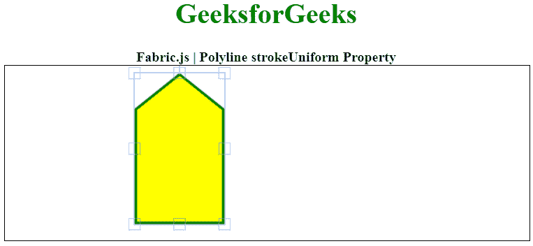

# Fabric.js 折线 stroke 统一属性

> 原文:[https://www . geesforgeks . org/fabric-js-polyline-stroke uniform-property/](https://www.geeksforgeeks.org/fabric-js-polyline-strokeuniform-property/)

在本文中，我们将看到如何使用**fabrijs**锁定画布**折线**的**统一笔画宽度**，以便即使我们将对象缩放到更大的尺寸，笔画宽度也保持不变。画布意味着折线是可移动的，可以根据需要进行拉伸。此外，在初始笔画颜色、填充颜色、笔画宽度或大小方面，可以自定义折线。

FabricJS JavaScript 库用于上述目的。使用 CDN 导入库后，我们将在主体标签中创建一个画布块，其中将包含我们的折线。之后，我们将初始化 FabricJS 提供的画布和折线实例，并使用 strokeUniform 属性锁定画布折线的统一笔画宽度，并在画布上渲染折线，如下例所示。

**语法:**

```
var polyline = new fabric.Polyline(Points, {  
   strokeUniform: string
 });  
```

**参数:**该属性接受如上所述的单个参数，如下所述:

*   **描边均匀:**当“假”时，描边宽度将随对象缩放。当为“真”时，笔划将始终与为笔划宽度输入的精确像素大小相匹配。默认值为“假”。

下面的例子说明了 Fabric.js 中的 strokeUniform 属性:

**示例:**

## 超文本标记语言

```
<!DOCTYPE html> 
<html> 
  <head> 
    <!-- Loading the FabricJS library -->
    <script src= 
"https://cdnjs.cloudflare.com/ajax/libs/fabric.js/3.6.2/fabric.min.js"> 
    </script> 
  </head> 

  <body> 
    <div style="text-align: center;width: 600px;"> 
      <h1 style="color: green;"> 
        GeeksforGeeks 
      </h1> 
      <b> 
        Fabric.js | Polyline strokeUniform Property 
      </b> 
    </div> 
    <canvas id="canvas"
            width="600"
            height="200"
            style="border:1px solid #000000;"> 
    </canvas> 

    <script> 

      // Initiate a Canvas instance 
            var polyline = new fabric.Polyline([ 
        {x: 200, y: 10 }, {x: 250, y: 50}, 
        {x: 250, y: 180}, {x: 150, y: 180}, 
        {x: 150, y: 50 }, {x: 200, y: 10 }], 
      { 
        stroke: 'green',  
        strokeWidth: 3,  
        fill: 'yellow',
        strokeUniform: false,  
      }); 

      // Render the polyline in canvas 
      canvas.add(polyline); 
    </script> 
  </body> 
</html>
```

**输出:**

