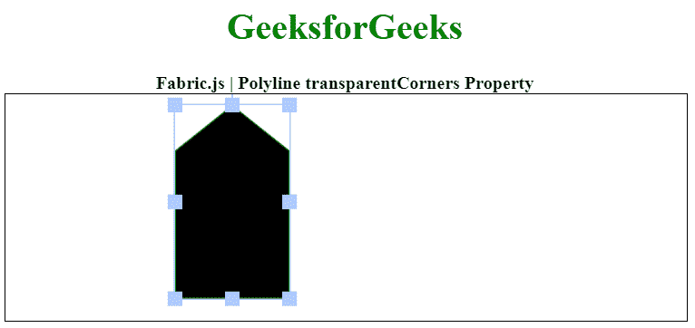

# Fabric.js 折线透明角属性

> 原文:[https://www . geesforgeks . org/fabric-js-polyline-transparentcorners-property/](https://www.geeksforgeeks.org/fabric-js-polyline-transparentcorners-property/)

在本文中，我们将看到如何使用 **FabricJS** 设置画布**折线**的角**可见性。画布意味着折线是可移动的，可以根据需要拉伸。此外，当涉及到初始笔画颜色、填充颜色、笔画宽度或半径时，可以对圆进行自定义。**

为了实现这一点，我们将使用一个名为 FabricJS 的 JavaScript 库。使用 CDN 导入库后，我们将在主体标签中创建一个画布块，其中将包含我们的折线。之后，我们将初始化由 FabricJS 提供的画布和折线实例，并分别使用 transparentCorners 属性设置折线拐角的可见性，并在画布上渲染折线，如下例所示。

**语法:**

```
var polyline = new fabric.Polyline(Points, {  
    transparentCorners: boolean
 });  
```

**参数:**该属性接受如上所述的单个参数，如下所述:

*   **透明角落:**指定是否启用角落的可见性。

下面的例子说明了 Fabric.js 中的 transparentCorners 属性:

**示例:**

## 超文本标记语言

```
<!DOCTYPE html> 
<html> 
  <head> 
    <!-- Loading the FabricJS library -->
    <script src= 
"https://cdnjs.cloudflare.com/ajax/libs/fabric.js/3.6.2/fabric.min.js"> 
    </script> 
  </head> 
  <body> 
    <div style="text-align: center;width: 600px;"> 
      <h1 style="color: green;"> 
        GeeksforGeeks 
      </h1> 
      <b> 
        Fabric.js | Polyline transparentCorners Property 
      </b> 
    </div> 
    <canvas id="canvas" width="600"
            height="200" style="border:1px solid #000000;"> 
    </canvas> 
    <script> 

      // Initiate a Canvas instance 
      var canvas = new fabric.Canvas("canvas"); 

      // Initiate a polyline instance 
            var polyline = new fabric.Polyline([ 
        {x: 200, y: 10 }, {x: 250, y: 50}, 
        {x: 250, y: 180}, {x: 150, y: 180}, 
        {x: 150, y: 50 }, {x: 200, y: 10 }], 
       { 
        stroke: 'green',  
        transparentCorners: false
      }); 

      // Render the polyline in canvas 
      canvas.add(polyline); 
    </script> 
  </body> 
</html>
```

**输出:**

