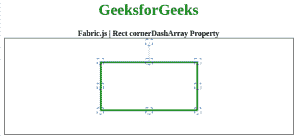

# Fabric.js |矩形角阵列属性

> 原文:[https://www . geesforgeks . org/fabric-js-rect-cornerdasharray-property/](https://www.geeksforgeeks.org/fabric-js-rect-cornerdasharray-property/)

在本文中，我们将看到如何使用 FabricJS 设置控制画布矩形角落的虚线模式。画布矩形意味着矩形是可移动的，可以根据需要拉伸。此外，当涉及到初始笔画颜色、高度、宽度、填充颜色或笔画宽度时，可以定制矩形。

为了实现这一点，我们将使用一个名为 FabricJS 的 JavaScript 库。导入库之后，我们将在主体标签中创建一个包含矩形的画布块。在此之后，我们将初始化由 FabricJS 提供的 canvas 和 Rectangle 的实例，并使用 cornerDashArray 属性设置控制 Canvas 矩形的角的虚线模式，并在 Canvas 上呈现矩形，如下例所示。

**语法:**

```
fabric.Rect({
    width: number,
    height: number,
    cornerDashArray: array
});
```

**参数:**该函数接受三个参数，如上所述，如下所述:

*   **宽度:**指定矩形的宽度。
*   **高度:**指定矩形的高度。
*   **角点阵列:**此参数定义控制角点的虚线图案。

**示例:**该示例使用 FabricJS 设置一个虚线模式来控制画布状矩形的角，如下所示。你必须点击对象才能看到控制角的虚线图案。

```
<!DOCTYPE html> 
<html> 

<head> 
    <title> 
        Fabric.js | Rect cornerDashArray Property
    </title> 

    <!-- Adding the FabricJS library -->
    <script src= 
"https://cdnjs.cloudflare.com/ajax/libs/fabric.js/3.6.2/fabric.min.js"> 
    </script> 
</head> 

<body> 
        <div style="text-align: center;width: 600px;">
          <h1 style="color: green;">
              GeeksforGeeks
          </h1>
          <b>
            Fabric.js | Rect cornerDashArray Property
          </b>
        </div>
    <canvas id="canvas" width="600" height="200"
        style="border:1px solid #000000"> 
    </canvas> 

    <script> 

        // Initiate a Canvas instance 
        var canvas = new fabric.Canvas("canvas"); 

        // Initiate a Rect instance 
        var rectangle = new fabric.Rect({ 
            width: 200,
            height: 100,
            fill: '', 
            stroke: 'green',
            strokeWidth: 3,
            cornerColor: 'blue',
            cornerDashArray: [5]
        }); 

        // Render the Rect in canvas 
        canvas.add(rectangle); 
        canvas.centerObject(rectangle);
    </script> 
</body> 

</html>
```

**输出:**
