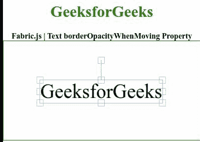

# 移动属性时的织物. js 文本边框

> 原文:[https://www . geeksforgeeks . org/fabric-js-text-borderopacitywhen moveing-property/](https://www.geeksforgeeks.org/fabric-js-text-borderopacitywhenmoving-property/)

在本文中，我们将看到如何使用 **Fabric.js** 在移动文本画布的时更改**边框。画布意味着书写的文本是可移动的、可旋转的、可调整大小的，并且可以拉伸。此外，文本本身不能像文本框一样编辑。**

为了实现这一点，我们将使用一个名为 **Fabric.js.** 的 JavaScript 库。在使用 CDN 导入库之后，我们将在主体标签中创建一个画布块，其中将包含我们的文本。之后，我们将初始化由 Fabric.js 提供的 canvas 和 Text 的实例，并使用**borderropacitywharting**属性设置 Canvas 文本的边框的不透明度。

**语法:**

```html
fabric.Text(text,
   borderOpacityWhenMoving: Number
); 
```

**参数:**该属性接受如上所述的单个参数，如下所述:

*   **移动时边框的不透明度:**指定移动时边框的不透明度，该参数取值范围为 0 到 1。

以下示例说明了在 **Fabric.js** 中移动属性时使用**borderropacity:**

**示例:**

## 超文本标记语言

```html
<!DOCTYPE html>
<html>
<head>
<!-- Loading the FabricJS library -->
  <script src=
"https://cdnjs.cloudflare.com/ajax/libs/fabric.js/3.6.2/fabric.min.js">
  </script>
</head>
<body>
  <div style="text-align: center;
              width: 400px;">
    <h1 style="color: green;">
      GeeksforGeeks
    </h1>
    <b>
      Fabric.js | Text borderOpacityWhenMoving Property
    </b>
  </div>
  <div style="text-align: center;">
    <canvas id="canvas"
            width="400" height="200"
      style="border:1px solid green;">
    </canvas>
  </div>
  <script>
    // Create a new instance of Canvas
    var canvas = new fabric.Canvas("canvas");

    // Create a new Text instance
    var geek = new fabric.Text('GeeksforGeeks', {
        borderOpacityWhenMoving: 0.2
    });

    // Render the text on Canvas
    canvas.add(geek);
    canvas.centerObject(geek);
  </script>
</body>
</html>
```

**输出:**

