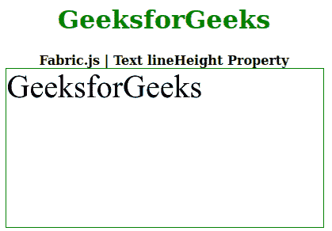

# Fabric.js 文本行高属性

> 原文:[https://www . geesforgeks . org/fabric-js-text-line height-property/](https://www.geeksforgeeks.org/fabric-js-text-lineheight-property/)

在本文中，我们将看到如何使用 **Fabric.js** 更改文本画布的**行高**。画布意味着书写的文本是可移动的、可旋转的、可调整大小的，并且可以拉伸。此外，文本本身不能像文本框一样编辑。

为了实现这一点，我们将使用一个名为 **Fabric.js.** 的 JavaScript 库。在使用 CDN 导入库之后，我们将在主体标签中创建一个画布块，其中将包含我们的文本。之后，我们将初始化 FabricJS 提供的 canvas 和 Text 实例，并使用 **lineHeight** 属性设置 Canvas 文本的行高。

**语法:**

```
 fabric.Text(text,
    lineHeight :Number
 ); 
```

**参数:**该属性接受一个参数，如上所述，如下所述:

*   **行高:**指定文本的行高。

以下示例说明了**织物. js** 中**线高**属性的使用:

**示例:**

## 超文本标记语言

```
<!DOCTYPE html>
<html>

  <head>
    <!-- Loading the FabricJS library -->
    <script src=
"https://cdnjs.cloudflare.com/ajax/libs/fabric.js/3.6.2/fabric.min.js">
    </script>
  </head>

  <body>
    <div style="text-align: center;width: 400px;">
      <h1 style="color: green;">
        GeeksforGeeks
      </h1>
      <b>
        Fabric.js | Text lineHeight Property
      </b>
    </div>

    <div style="text-align: center;">
      <canvas id="canvas" width="400" height="200"
              style="border:1px solid green;">
      </canvas>
    </div>

    <script>
      // Create a new instance of Canvas
      var canvas = new fabric.Canvas("canvas");

      // Create a new Text instance
      var geek = new fabric.Text('GeeksforGeeks', {
        width: 300,
        lineHeight: 5 
      });

      // Render the text on Canvas
      canvas.add(geek);
    </script>
  </body>

</html>
```

**输出:**



**参考:**T2http://fabricjs.com/docs/fabric.Text.html#lineHeight