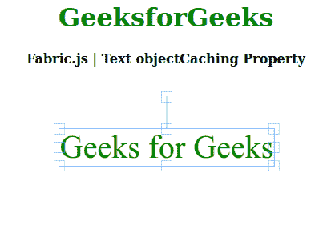

# Fabric.js 文本对象缓存属性

> 原文:[https://www . geesforgeks . org/fabric-js-text-object cache-property/](https://www.geeksforgeeks.org/fabric-js-text-objectcaching-property/)

在本文中，我们将看到如何使用 **Fabric.js** 更改文本画布的**对象缓存**。画布意味着书写的文本是可移动的、可旋转的、可调整大小的，并且可以拉伸。此外，文本本身不能像文本框一样编辑。

**方法:**为了实现这一点，我们将使用一个名为 **Fabric.js.** 的 JavaScript 库，在使用 CDN 导入库之后，我们将在 body 标签中创建一个画布块，其中将包含我们的文本。之后，我们将初始化 FabricJS 提供的 canvas 和 Text 实例，并使用**对象缓存**属性设置 Canvas 文本的对象缓存。

**语法:**

```
 fabric.Text(text,
    objectCaching :Boolean
 ); 
```

**参数:**该属性接受一个参数，如上所述，如下所述:

*   **对象缓存:**当设置为*真*时，对象缓存在附加画布上。当设置为*假*时，除非必要，否则对象不会被缓存(剪辑路径)。默认值为*真*。

以下示例说明了在 **Fabric.js** 中使用**对象缓存**属性:

**示例:**

## 超文本标记语言

```
<!DOCTYPE html> 
<html> 

<head> 
<!-- Loading the FabricJS library -->
  <script src= 
"https://cdnjs.cloudflare.com/ajax/libs/fabric.js/3.6.2/fabric.min.js"> 
  </script> 
</head> 

<body> 
  <div style="text-align: center;width: 400px;"> 
    <h1 style="color: green;"> 
      GeeksforGeeks 
    </h1>
    <b> 
      Fabric.js | Text objectCaching Property 
    </b> 
  </div> 

  <div style="text-align: center;"> 
    <canvas id="canvas" width="400" height="200"
      style="border:1px solid green;"> 
    </canvas> 
  </div> 

  <script> 
    // Create a new instace of Canvas 
    var canvas = new fabric.Canvas("canvas"); 

    // Create a new Text instance 
    var geek = new fabric.Text('Geeks for Geeks', { 
      fill: 'green', 
      objectCaching: 'false' 
    }); 

    // Render the text on Canvas 
    canvas.add(geek); 
    canvas.centerObject(geek);
  </script> 
</body> 

</html>
```

**输出:**

