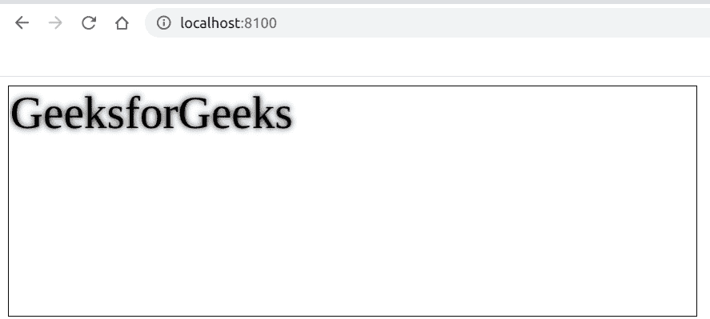

# Fabric.js |文字阴影属性

> 原文:[https://www . geesforgeks . org/fabric-js-text-shadow-property/](https://www.geeksforgeeks.org/fabric-js-text-shadow-property/)

在本文中，我们将看到如何使用 FabricJS 为文本画布添加阴影。画布意味着书写的文本是可移动的、可旋转的、可调整大小的，并且可以拉伸。但在本文中，我们将为其添加阴影。此外，文本本身不能像文本框一样编辑。

**方法:**为了使其成为可能，我们将使用一个名为 FabricJS 的 JavaScript 库。使用 CDN 导入库后，我们将在主体标签中创建一个包含文本的*画布*块。在此之后，我们将初始化由 FabricJS 提供的画布和文本的实例，并使用**阴影**属性来添加阴影，并在文本上渲染画布，如下例所示。

**语法:**

```
fabric.text(text :string, shadow: fabric.shadow); 
```

**参数:**该函数接受两个参数，如上所述，如下所述:

*   **文字:**指定文字内容。
*   **阴影:**指定阴影对象。

**程序:**本示例使用 FabricJS 为文本画布添加阴影。

## 超文本标记语言

```
<!DOCTYPE html>
<html>

<head>
    <title>
        Fabric.js | Text shadow Property
    </title>

    <!-- Loading the FabricJS library -->
    <script src=
"https://cdnjs.cloudflare.com/ajax/libs/fabric.js/3.6.2/fabric.min.js">
    </script>
</head>

<body>
    <canvas id="canvas" width="600" height="200"
        style="border:1px solid #000000;">
    </canvas>

    <script>

        // Create a new instance of Canvas
        var canvas = new fabric.Canvas("canvas");

        // Create shadow object
        var shadow = new fabric.Shadow({
            color: 'black',
            blur: 5
        });

        // Create a new Text instance
        var text = new fabric.Text('GeeksforGeeks', {
            shadow: shadow
        });

        // Render the text on Canvas
        canvas.add(text);
    </script>
</body>

</html>
```

**输出:**

