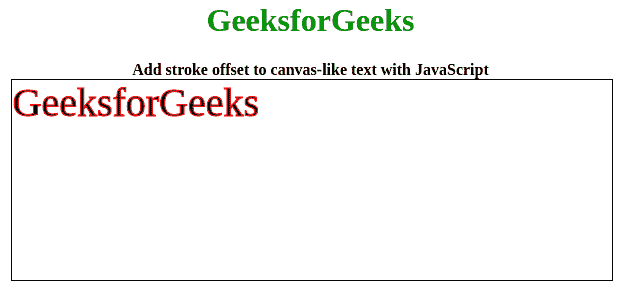

# fabric . js | Text strokeDashOffset 属性

> 原文:[https://www . geesforgeks . org/fabric-js-text-strokedashoffset-property/](https://www.geeksforgeeks.org/fabric-js-text-strokedashoffset-property/)

在本文中，我们将看到如何使用 FabricJS 向文本画布添加笔画偏移。画布意味着书写的文本是可移动的、可旋转的、可调整大小的，并且可以拉伸。但是在本文中，我们将添加一个笔画偏移。此外，文本本身不能像文本框一样编辑。

为了实现这一点，我们将使用一个名为 FabricJS 的 JavaScript 库。使用 CDN 导入库后，我们将在主体标签中创建一个包含我们的文本的**画布**块。之后，我们将初始化 FabricJS 提供的 Canvas 和 Text 的实例，并使用**笔画**属性创建一个笔画，并进一步使用 **strokeDashOffset** 属性添加笔画偏移，并在 Text 上渲染 Canvas，如下例所示。

**语法:**

```
fabric.text(
    text: string, 
    strokeDashOffset: number, 
    stroke: string
);
```

**参数:**该功能接受三个参数，如上所述，描述如下:

*   **文本:**该参数指定文本。
*   **冲程偏移量:**该参数定义冲程的偏移量。
*   **笔画:**此参数定义笔画颜色。

**示例:**本示例使用 FabricJS 向文本画布添加笔画偏移，如下所示。

## 超文本标记语言

```
<!DOCTYPE html>
<html>

<head>
    <title>
        Fabric.js | Text strokeDashOffset Property
    </title>

    <!-- Loading the FabricJS library -->
    <script src=
"https://cdnjs.cloudflare.com/ajax/libs/fabric.js/3.6.2/fabric.min.js">
    </script>
</head>

<body>
    <center>
        <h1 style="color: green;">GeeksforGeeks</h1>

        <b>
            Add stroke offset to canvas-like
            text with JavaScript
        </b>

        <canvas id="canvas" width="600" height="200"
            style="border:1px solid #000000;">
        </canvas>

        <script>

            // Create a new instance of Canvas
            var canvas = new fabric.Canvas("canvas");

            // Create a new Text instance
            var text = new fabric.Text('GeeksforGeeks', {
                strokeDashOffset: 10,
                stroke: 'red'
            });

            // Render the text on Canvas
            canvas.add(text);
        </script>
    </center>
</body>

</html>                   
```

**输出:**

