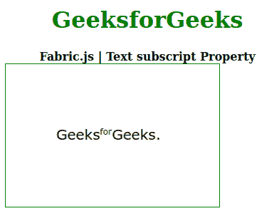

# 织物. js 文字上标属性

> 原文:[https://www . geesforgeks . org/fabric-js-text-上标-property/](https://www.geeksforgeeks.org/fabric-js-text-superscript-property/)

在本文中，我们将看到如何使用 **Fabric.js** 更改文本画布的**上标**。画布意味着书写的文本是可移动的、可旋转的、可调整大小的，并且可以拉伸。此外，文本本身不能像文本框一样编辑。

为了实现这一点，我们将使用一个名为 **Fabric.js.** 的 JavaScript 库。在使用 CDN 导入库之后，我们将在主体标签中创建一个画布块，其中将包含我们的文本。之后，我们将初始化由 FabricJS 提供的 canvas 和 Text 的实例，并使用**上标**属性设置 Canvas 文本的上标。

**语法:**

```
 fabric.Text(text,
    superscript :Object
 ); 
```

**参数:**该属性接受一个参数，如上所述，如下所述:

*   **上标:**它定义了对象。

下面的例子说明了**织物**中**上标**属性的使用:

**示例:**

## 超文本标记语言

```
<!DOCTYPE html>
<html>

  <head>
    <script src=
"https://github.com/denim2x/fabric.js/releases/download/v2.0.0-beta.6/fabric.min.js">
    </script>
  </head>

  <body>
    <div style="text-align: center;width: 400px;"> 
      <h1 style="color: green;"> 
        GeeksforGeeks 
      </h1>
      <b> 
        Fabric.js | Text superscript Property 
      </b> 
    </div> 

    <canvas id="stage" width="300" height="200" 
            style="border:1px solid green;">
    </canvas>

    <script>
      var canvas = new fabric.Canvas(stage);
      var text = new fabric.Text(
        'GeeksforGeeks.',
        { fontSize: 20, fontFamily: 'Verdana' }
      );
      canvas.add(text);
      canvas.centerObject(text);
      text.setSelectionStyles('superscript', 5, 8);
    </script>
  </body>

</html>
```

**输出:**



**参考:**T2】http://fabricjs.com/docs/fabric.Text.html#superscript