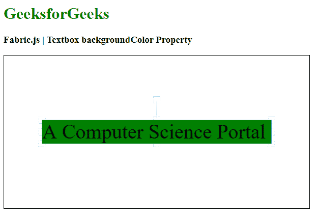

# 织物. js 文本框背景颜色属性

> 原文:[https://www . geesforgeks . org/fabric-js-textbox-background color-property/](https://www.geeksforgeeks.org/fabric-js-textbox-backgroundcolor-property/)

在本文中，我们将看到如何使用 Fabric.js 更改 Textbox 的背景颜色。Fabric.js 中的 Textbox 是可移动的，可以根据需要进行拉伸。此外，当涉及到初始笔画颜色、高度、宽度、填充颜色或笔画宽度时，可以自定义文本框。

**方法:**为了使其成为可能，我们将使用一个名为 Fabric.js 的 JavaScript 库。导入库后，我们将在 body 标记中创建一个画布块，其中将包含 Textbox。之后，我们将初始化由 Fabric.js 提供的 canvas 和 Textbox 的实例，使用 background color 属性更改 canvas Textbox 的背景颜色，并在 Canvas 上呈现，如下例所示。

**语法:**

```
fabric.Textbox('text', {
    backgroundColor: string
});
```

**参数:**该函数接受如上所述的单个参数，如下所述:

*   **backgroundColor:** 这是要在文本框上使用的背景颜色。

**示例:**本示例使用 Fabric.js 更改 Textbox 画布的背景颜色。

## 超文本标记语言

```
<html>
<head>
    <!-- Adding the FabricJS library -->
    <script src=
"https://cdnjs.cloudflare.com/ajax/libs/fabric.js/3.6.2/fabric.min.js">
    </script>
</head>
<body>
    <h1 style="color: green;">
        GeeksforGeeks
    </h1>
    <h3>
        Fabric.js | Textbox backgroundColor Property
    </h3>
    <canvas id="canvas" width="600" height="300" 
            style="border:1px solid #000000">
    </canvas>
    <script>

        // Initiate a Canvas instance 
        var canvas = new fabric.Canvas("canvas");

        // Create a new Textbox instance 
        var text = new fabric.Textbox(
            'A Computer Science Portal', {
            width: 450,
            backgroundColor: 'green'
        });

        // Render the Textbox in canvas 
        canvas.add(text);
        canvas.centerObject(text);
    </script>
</body>
</html>
```

**输出:**

