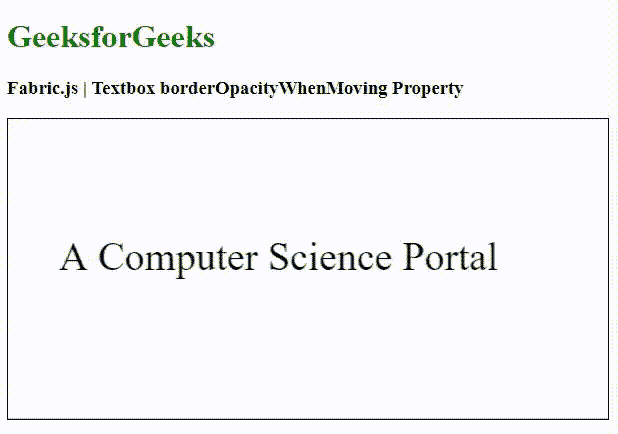

# 移动属性时的织物. js 文本框边框属性

> 原文:[https://www . geeksforgeeks . org/fabric-js-textbox-borderopacitywhenting-property/](https://www.geeksforgeeks.org/fabric-js-textbox-borderopacitywhenmoving-property/)

在本文中，我们将看到如何绘制一个画布文本框，当用户使用 FabricJS 移动文本框时，其中的边框不透明度将会改变。画布文本框意味着文本框是可移动的，可以根据需要拉伸。此外，当涉及到初始笔画颜色、高度、宽度、填充或笔画宽度时，可以自定义文本框。

**进场:**

*   为了实现这一点，我们将使用一个名为 FabricJS 的 JavaScript 库。
*   导入库后，我们将在主体标签中创建一个包含文本框的画布块。
*   之后，我们将初始化由 FabricJS 提供的 canvas 和 Textbox 的实例，并使用 borderropacitywhenmovement 属性启用 canvas Textbox 的 borderropacitywhenmovement，并在 Canvas 上呈现 Textbox，如下所示。

**语法:**

```
fabric.Textbox('text', {
    borderOpacityWhenMoving: number
});
```

**参数:**该功能接受如上所述的单个参数，如下所述:

**边框透明度移动时:**此参数定义文本框的边框透明度。

**示例:**该示例使用 FabricJS 在移动类似画布的文本框时启用 borderOpacityWhenMoving，如下所示。在启用 borderpropacitywhen 移动属性后移动对象时，它会将文本框边框的不透明度更改一个定义的数字。

## 超文本标记语言

```
<!DOCTYPE html>
<html>

<head>
    <title>
        Fabric.js | Textbox borderOpacityWhenMoving Property
    </title>

    <!-- Adding the FabricJS library -->
    <script src=
"https://cdnjs.cloudflare.com/ajax/libs/fabric.js/3.6.2/fabric.min.js">
    </script>
</head>

<body>
    <h1 style="color: green;">
        GeeksforGeeks
    </h1>

    <h3>
        Fabric.js | Textbox borderOpacityWhenMoving Property
    </h3>

    <canvas id="canvas" width="600" height="300"
        style="border:1px solid #000000">
    </canvas>

    <script>

        // Initiate a Canvas instance 
        var canvas = new fabric.Canvas("canvas");

        // Create a new Textbox instance 
        var text = new fabric.Textbox(
            'A Computer Science Portal', {
            width: 450,
            borderOpacityWhenMoving: 0
        });

        // Render the Textbox in canvas 
        canvas.add(text);
        canvas.centerObject(text);
    </script>
</body>

</html>
```

**输出:**

