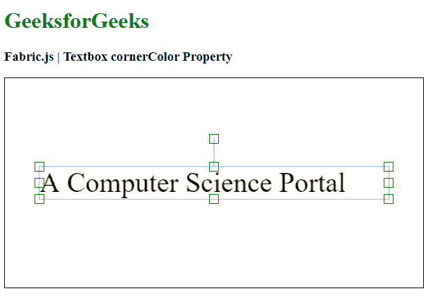

# Fabric.js 文本框角颜色属性

> 原文:[https://www . geesforgeks . org/fabric-js-textbox-corner color-property/](https://www.geeksforgeeks.org/fabric-js-textbox-cornercolor-property/)

在本文中，我们将看到如何使用 Fabric.js 改变画布 Textbox 的控制角颜色。此外，文本框可以自定义初始笔画颜色、填充颜色、笔画宽度或半径。

为了实现这一点，我们将使用一个名为 Fabric.js 的 JavaScript 库。在使用 CDN 导入库之后，我们将在包含我们的 Textbox 的主体标签中创建一个画布块。之后，我们将初始化 Fabric.js 提供的 Canvas 和 Textbox 的实例，并使用 cornerColor 属性更改 Textbox 的控制角颜色，并在 Canvas 上呈现 Textbox，如下例所示。

**语法:**

```
fabric.Textbox('text', {
    cornerColor: string
});
```

**参数:**该函数接受如上所述的单个参数，如下所述:

*   **角颜色:**该参数指定控制角的颜色。

**示例:**本示例使用 Fabric.js 更改画布 Textbox 的控制角颜色。请注意，您必须单击对象才能看到颜色。

## 超文本标记语言

```
<html>
<head>
    <!-- Adding the FabricJS library -->
    <script src=
"https://cdnjs.cloudflare.com/ajax/libs/fabric.js/3.6.2/fabric.min.js">
    </script>
</head>
<body>
    <h1 style="color: green;">
        GeeksforGeeks
    </h1>
    <h3>
        Fabric.js | Textbox cornerColor Property
    </h3>
    <canvas id="canvas" width="600" height="300" 
        style="border:1px solid #000000">
    </canvas>
    <script>
        // Initiate a Canvas instance 
        var canvas = new fabric.Canvas("canvas");

        // Create a new Textbox instance 
        var text = new fabric.Textbox(
            'A Computer Science Portal', {
            width: 500,
            cornerColor: 'green'
        });

        // Render the Textbox in canvas 
        canvas.add(text);
        canvas.centerObject(text);
    </script>
</body>
</html>
```

**输出:**

