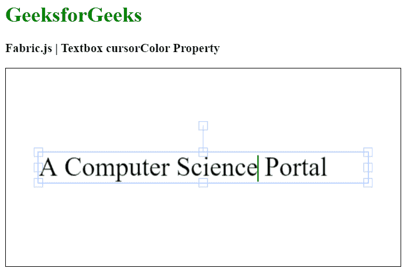

# Fabric.js 文本框光标颜色属性

> 原文:[https://www . geesforgeks . org/fabric-js-textbox-cursorcolor-property/](https://www.geeksforgeeks.org/fabric-js-textbox-cursorcolor-property/)

在本文中，我们将看到如何使用 Fabric.js 设置画布 Textbox 的光标颜色角的样式。此外，文本框可以自定义初始笔画颜色、填充颜色、笔画宽度或半径。

**方法:**为了使其成为可能，我们将使用一个名为 Fabric.js 的 JavaScript 库。导入库后，我们将在 body 标记中创建一个画布块，其中将包含 Textbox。之后，我们将初始化 Fabric.js 提供的 canvas 和 Textbox 的实例，并使用 cursor color 属性设置 canvas Textbox 的光标颜色样式，并在 Canvas 上呈现 Textbox，如下例所示。

**语法:**

```
fabric.Textbox('text', {
    cursorColor: string
});
```

**参数:**该函数接受如上所述的单个参数，如下所述:

*   **光标颜色:**指定光标的颜色。

**示例:**本示例使用 Fabric.js 设置文本框的光标颜色样式，如下所示。

## 超文本标记语言

```
<html>
<head>
    <!-- Adding the FabricJS library -->
    <script src=
"https://cdnjs.cloudflare.com/ajax/libs/fabric.js/4.3.0/fabric.min.js">
    </script>
</head>
<body>
    <h1 style="color: green;">
        GeeksforGeeks
    </h1>
    <h3>
        Fabric.js | Textbox cursorColor Property
    </h3>
    <canvas id="canvas" width="600" height="300" 
        style="border:1px solid #000000">
    </canvas>
    <script>
        // Initiate a Canvas instance 
        var canvas = new fabric.Canvas("canvas");

        // Create a new Textbox instance 
        var text = new fabric.Textbox(
            'A Computer Science Portal', {
            width: 500,
            cursorColor: "green"
        });

        // Render the Textbox in canvas 
        canvas.add(text);
        canvas.centerObject(text);
    </script>
</body>
</html>
```

**输出:**

