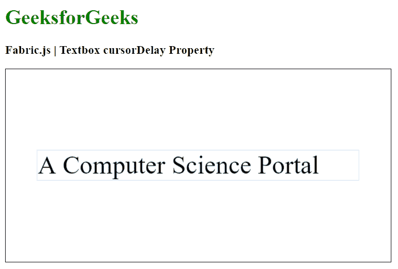

# Fabric.js 文本框光标拖动属性

> 原文:[https://www . geesforgeks . org/fabric-js-textbox-cursordelay-property/](https://www.geeksforgeeks.org/fabric-js-textbox-cursordelay-property/)

在本文中，我们将看到如何使用 Fabric.js 设置 Textbox 画布的光标延迟。Fabric.js 中的 Textbox 是可移动的，可以根据需要进行拉伸。此外，当涉及到初始笔画颜色、高度、宽度、填充颜色或笔画宽度时，可以自定义文本框。

为了实现这一点，我们将使用一个名为 Fabric.js 的 JavaScript 库。导入库后，我们将在主体标签中创建一个包含 Textbox 的画布块。之后，我们将初始化 Fabric.js 提供的 Canvas 和 Textbox 的实例，并使用 cursor delay 属性设置 Textbox 的光标延迟，并在 Canvas 上呈现 Textbox，如下例所示。

**语法:**

```
fabric.Textbox('text', {
    cursorDelay: number
});
```

**参数:**该函数接受如上所述的单个参数，如下所述:

*   **cursorDelay:** 指定光标闪烁之间的延迟时间，单位为毫秒。

**示例:**本示例使用 Fabric.js 设置 Textbox 的光标延迟。

## 超文本标记语言

```
<html>
<head>
    <!-- Adding the FabricJS library -->
    <script src=
"https://cdnjs.cloudflare.com/ajax/libs/fabric.js/4.3.0/fabric.min.js">
    </script>
</head>
<body>
    <h1 style="color: green;">
        GeeksforGeeks
    </h1>
    <h3>
        Fabric.js | Textbox cursorDelay Property
    </h3>
    <canvas id="canvas" width="600" height="300"
            style="border:1px solid #000000">
    </canvas>
    <script>
        // Initiate a Canvas instance 
        var canvas = new fabric.Canvas("canvas");

        // Create a new Textbox instance 
        var text = new fabric.Textbox(
            'A Computer Science Portal', {
            width: 500,
            cursorColor: "green",
            cursorDelay: 1000
        });

        // Render the Textbox in canvas 
        canvas.add(text);
        canvas.centerObject(text);
    </script>
</body>
</html>
```

**输出:**

