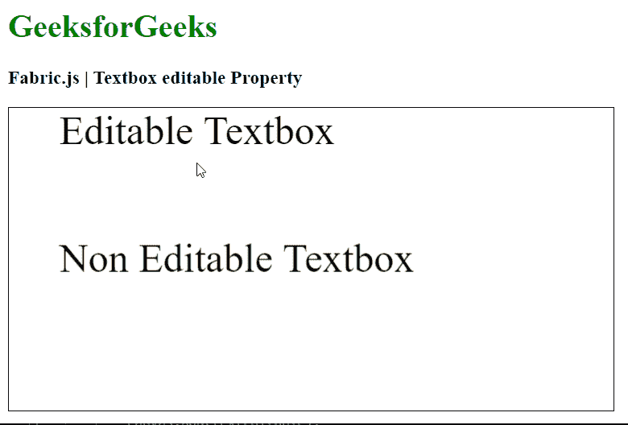

# Fabric.js 文本框可编辑属性

> 原文:[https://www . geesforgeks . org/fabric-js-textbox-editable-property/](https://www.geeksforgeeks.org/fabric-js-textbox-editable-property/)

在本文中，我们将看到如何使用 Fabric.js 设置 Textbox 画布的编辑模式。Fabric.js 中的 Textbox 是可移动的，可以根据需求进行拉伸。此外，当涉及到初始笔画颜色、高度、宽度、填充颜色或笔画宽度时，可以自定义文本框。

为了实现这一点，我们将使用一个名为 Fabric.js 的 JavaScript 库。在使用 CDN 导入库之后，我们将在主体标签中创建一个包含 Textbox 的画布块。之后，我们将初始化 Fabric.js 提供的 Canvas 和 Textbox 的实例，使用可编辑属性设置编辑模式，并在 Canvas 上呈现 Textbox，如下例所示。

**语法:**

```
fabric.Textbox('text', {
    editable: boolean
});
```

**参数:**该属性接受如上所述的单个参数，如下所述:

*   **可编辑:**指定文本框的编辑模式。值**为真**使文本框可编辑，值**为假**禁用编辑。

**示例:**本示例使用 Fabric.js 设置文本框的编辑模式。

## 超文本标记语言

```
<html>
<head>
    <script src=
"https://cdnjs.cloudflare.com/ajax/libs/fabric.js/4.3.0/fabric.min.js">
    </script>
</head>
<body>
    <h1 style="color: green;">
        GeeksforGeeks
    </h1>
    <h3>
        Fabric.js | Textbox editable Property
    </h3>
    <canvas id="canvas" width="600" height="300"
            style="border:1px solid #000000">
    </canvas>
    <script>
        // Initiate a Canvas instance 
        var canvas = new fabric.Canvas("canvas");

        // Create new Textbox instances 
        var textEditable = new fabric.Textbox(
            'Editable Textbox', {
            width: 500,
            editable: true
        });

        var textNonEditable = new fabric.Textbox(
            'Non Editable Textbox', {
            width: 500,
            editable: false
        });

        // Render the Textbox in canvas 
        canvas.add(textEditable);
        canvas.add(textNonEditable);

        canvas.centerObject(textNonEditable);
        canvas.centerObjectH(textEditable);
    </script>
</body>
</html>
```

**输出:**

