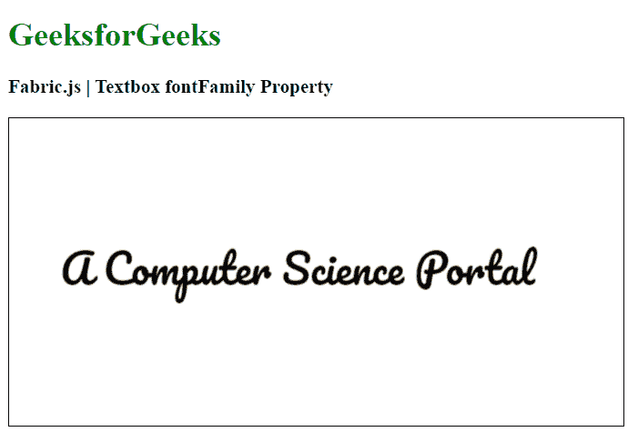

# Fabric.js Textbox fontFamily 属性

> 原文:[https://www . geesforgeks . org/fabric-js-textbox-font family-property/](https://www.geeksforgeeks.org/fabric-js-textbox-fontfamily-property/)

在本文中，我们将看到如何使用 FabricJS 更改文本画布的字体系列。画布意味着书写的文本是可移动的，可以根据需要拉伸。此外，文本本身不能像文本框一样编辑。

为了实现这一点，我们将使用一个名为 FabricJS 的 JavaScript 库。使用 CDN 导入库后，我们将在主体标签中创建一个画布块，其中将包含我们的文本框。之后，我们将初始化由 FabricJS 提供的 Canvas 和 Textbox 的实例，并使用 fontFamily 属性来更改字体系列，并在 Textbox 上呈现 Canvas，如下例所示。

**语法:**

```
fabric.Textbox('text', {
    fontFamily: string
});
```

**参数:**该函数接受一个参数，如上所述，如下所述:

*   **字体系列:**指定字体系列。

**示例:**我们可以使用 FabricJS 来更改类似画布的文本框的 fontFamily，如下所示:

## 超文本标记语言

```
<!DOCTYPE html>
<html>

<head>
    <!-- Adding the FabricJS library -->
    <script src=
"https://cdnjs.cloudflare.com/ajax/libs/fabric.js/3.6.2/fabric.min.js">
    </script>

    <link href=
"https://fonts.googleapis.com/css2?family=Pacifico&display=swap" 
    rel="stylesheet">
</head>

<body>
  <h1 style="color: green;">
      GeeksforGeeks
  </h1>

  <h3>
      Fabric.js | Textbox fontFamily Property
  </h3>

  <canvas id="canvas" width="600" height="300" 
      style="border:1px solid #000000">
  </canvas>

  <script>

      // Initiate a Canvas instance 
      var canvas = new fabric.Canvas("canvas");

      // Create a new Textbox instance 
      var text = new fabric.Textbox(
          'A Computer Science Portal', {
          width: 500,
          fontFamily: 'Pacifico'
      });

      // Render the Textbox in canvas 
      canvas.add(text);
      canvas.centerObject(text);
  </script>
</body>

</html>
```

**输出:**

