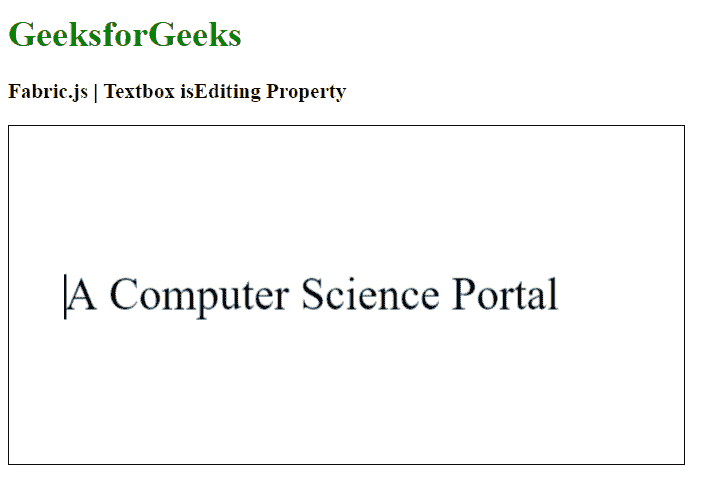

# Fabric.js 文本框编辑属性

> 原文:[https://www . geesforgeks . org/fabric-js-textbox-isediting-property/](https://www.geeksforgeeks.org/fabric-js-textbox-isediting-property/)

在本文中，我们将看到如何使用 Fabric.js 设置文本框的 isEditing 属性。此外，文本框可以自定义初始笔画颜色、填充颜色、笔画宽度或半径。

为了实现这一点，我们将使用一个名为 Fabric.js 的 JavaScript 库。导入库后，我们将在主体标签中创建一个包含 Textbox 的画布块。之后，我们将初始化画布和文本框的实例，设置文本框的 isEditing 属性，使其看起来像是正在被编辑，并在画布上呈现文本框，如下例所示。

**语法:**

```
fabric.Textbox('text', {
    isEditing: boolean
});
```

**参数:**该函数接受如上所述的单个参数，如下所述:

*   **isEditing:** 指定 isEditing 属性的布尔值。

**示例:**本示例使用 Fabric.js 设置 Textbox 的 isEditing 属性。

## 超文本标记语言

```
<html>
<head>
    <!-- Adding the FabricJS library -->
    <script src=
"https://cdnjs.cloudflare.com/ajax/libs/fabric.js/3.6.2/fabric.min.js">
    </script>
</head>
<body>
    <h1 style="color: green;">
        GeeksforGeeks
    </h1>
    <h3>
        Fabric.js | Textbox isEditing Property
    </h3>
    <canvas id="canvas" width="600" height="300"
        style="border:1px solid #000000">
    </canvas>
    <script>
        // Initiate a Canvas instance 
        var canvas = new fabric.Canvas("canvas");

        // Create a new Textbox instance 
        var text = new fabric.Textbox(
            'A Computer Science Portal', {
            width: 500,
            isEditing: true
        });

        // Render the Textbox in canvas 
        canvas.add(text);
        canvas.centerObject(text);
    </script>
</body>
</html>
```

**输出:**

