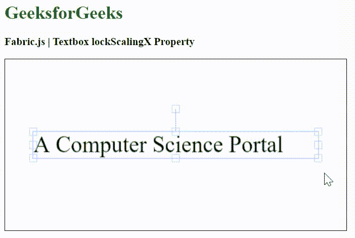

# fabric . js Textbox lockScalingX 属性

> 原文:[https://www . geesforgeks . org/fabric-js-textbox-lockscalingx-property/](https://www.geeksforgeeks.org/fabric-js-textbox-lockscalingx-property/)

在本文中，我们将看到如何使用 FabricJS 中的 **lockScalingX** 属性来锁定画布文本框的水平缩放。画布意味着文本框是可移动的，可以根据需要拉伸。此外，文本框可以自定义初始笔画颜色、填充颜色、笔画宽度或半径。

**进场:**

*   为了实现这一点，我们将使用一个名为 FabricJS 的 JavaScript 库。
*   使用 CDN 导入库后，我们将在主体标签中创建一个画布块，其中将包含我们的文本框。
*   之后，我们将初始化 FabricJS 提供的 Canvas 和 Textbox 的实例，并使用 lockScalingX 属性锁定 Textbox 的水平缩放，并在 Canvas 上呈现 Textbox，如下例所示。

**语法:**

```
fabric.Textbox('text', {
   lockScalingX: boolean
});
```

**参数:**该函数只接受一个参数，如上所述，如下所述:

*   **lockScalingX:** 是一个布尔值，指定是否锁定水平缩放。

**示例:**我们将使用 FabricJS 来锁定文本框画布的水平缩放，如下所示。

## 超文本标记语言

```
<!DOCTYPE html>
<html>

<head>
   <!-- Adding the FabricJS library -->
   <script src=
"https://cdnjs.cloudflare.com/ajax/libs/fabric.js/3.6.2/fabric.min.js">
   </script>
</head>

<body>
   <h1 style="color: green;">
      GeeksforGeeks
   </h1>

   <h3>
      Fabric.js | Textbox lockScalingX Property
   </h3>

   <canvas id="canvas" width="600" height="300" 
      style="border:1px solid #000000">
   </canvas>

   <script>
      // Initiate a Canvas instance 
      var canvas = new fabric.Canvas("canvas");

      // Create a new Textbox instance 
      var text = new fabric.Textbox(
         'A Computer Science Portal', {
         width: 500,
         lockScalingX: true
      });

      // Render the Textbox in canvas 
      canvas.add(text);
      canvas.centerObject(text);
   </script>
</body>

</html>
```

**输出:**

