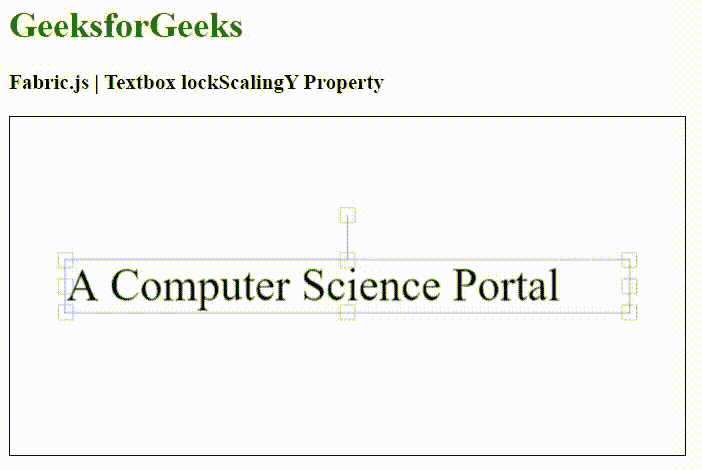

# Fabric.js 文本框锁频属性

> 原文:[https://www . geesforgeks . org/fabric-js-textbox-lock scaling-property/](https://www.geeksforgeeks.org/fabric-js-textbox-lockscalingy-property/)

在本文中，我们将看到如何使用 FabricJS 锁定画布 Textbox 的垂直缩放。画布意味着文本框是可移动的，可以根据需要拉伸。此外，文本框可以自定义初始笔画颜色、填充颜色、笔画宽度或半径。

**进场:**

*   为了实现这一点，我们将使用一个名为 FabricJS 的 JavaScript 库。
*   使用 CDN 导入库后，我们将在主体标签中创建一个画布块，其中将包含我们的文本框。
*   之后，我们将初始化 FabricJS 提供的 Canvas 和 Textbox 的实例，并使用 lockScalingY 属性锁定 Textbox 的垂直缩放，并在 Canvas 上呈现 Textbox，如下例所示。

**语法:**

```
fabric.Textbox('text', {
   lockScalingY: boolean
});
```

**参数:**该函数接受两个参数，如上所述，如下所述:

*   **锁定缩放:**指定是否锁定垂直缩放。

**示例:**本示例使用 FabricJS 锁定画布文本框的垂直缩放。

## 超文本标记语言

```
<!DOCTYPE html>
<html>

<head>
    <title>
        Fabric.js | Textbox lockScalingY Property
    </title>

    <!-- Adding the FabricJS library -->
    <script src=
"https://cdnjs.cloudflare.com/ajax/libs/fabric.js/3.6.2/fabric.min.js">
    </script>
</head>

<body>
    <h1 style="color: green;">
        GeeksforGeeks
    </h1>

    <h3>
        Fabric.js | Textbox lockScalingY Property
    </h3>

    <canvas id="canvas" width="600" height="300" 
        style="border:1px solid #000000">
    </canvas>

    <script>

        // Initiate a Canvas instance 
        var canvas = new fabric.Canvas("canvas");

        // Create a new Textbox instance 
        var text = new fabric.Textbox(
            'A Computer Science Portal', {
            width: 500,
            lockScalingY: true
        });

        // Render the Textbox in canvas 
        canvas.add(text);
        canvas.centerObject(text);
    </script>
</body>

</html>
```

**输出:**

