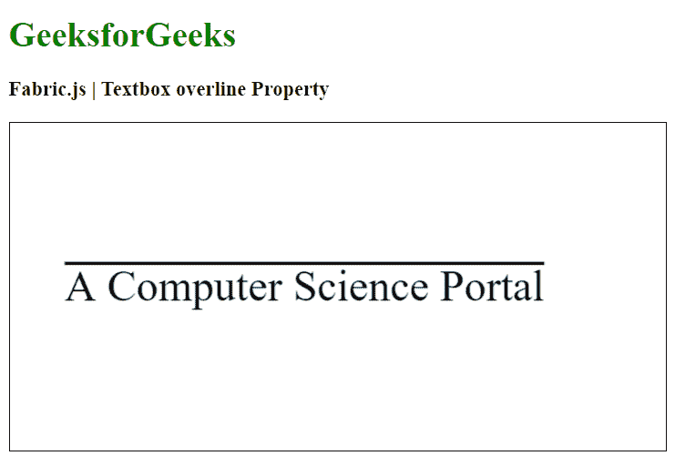

# Fabric.js 文本框跨线属性

> 原文:[https://www . geesforgeks . org/fabric-js-textbox-overline-property/](https://www.geeksforgeeks.org/fabric-js-textbox-overline-property/)

在本文中，我们将看到如何使用 Fabric.js 向画布 Textbox 添加跨线文本装饰。此外，当涉及到初始笔画颜色、高度、宽度、填充颜色或笔画宽度时，可以自定义文本框。

**方法:**为了使其成为可能，我们将使用一个名为 Fabric.js 的 JavaScript 库。在使用 CDN 导入库之后，我们将在主体标签中创建一个画布块，其中将包含我们的 Textbox。之后，我们将初始化 Fabric.js 提供的 Canvas 和 Textbox 的实例，使用 overline 属性添加一个 overline，并在 Textbox 上呈现 Canvas，如下例所示。

**语法:**

```
fabric.Textbox('text', {
   overline: boolean
});
```

**参数:**该函数接受如上所述的单个参数，如下所述:

*   **跨线:**指定是否启用跨线文字修饰。

**示例:**我们可以使用 Fabric.js 给文本框添加上划线，如下所示。

## 超文本标记语言

```
<html>
<head>
    <!-- Adding the FabricJS library -->
    <script src=
"https://cdnjs.cloudflare.com/ajax/libs/fabric.js/4.3.0/fabric.min.js">
    </script>
</head>
<body>
    <h1 style="color: green;">
        GeeksforGeeks
    </h1>
    <h3>
        Fabric.js | Textbox overline Property
    </h3>
    <canvas id="canvas" width="600" height="300"
            style="border:1px solid #000000">
    </canvas>
    <script>
        // Initiate a Canvas instance 
        var canvas = new fabric.Canvas("canvas");

        // Create a new Textbox instance 
        var text = new fabric.Textbox(
            'A Computer Science Portal', {
            width: 500,
            overline: true
        });

        // Render the Textbox in canvas 
        canvas.add(text);
        canvas.centerObject(text);
    </script>
</body>
</html>
```

**输出:**

