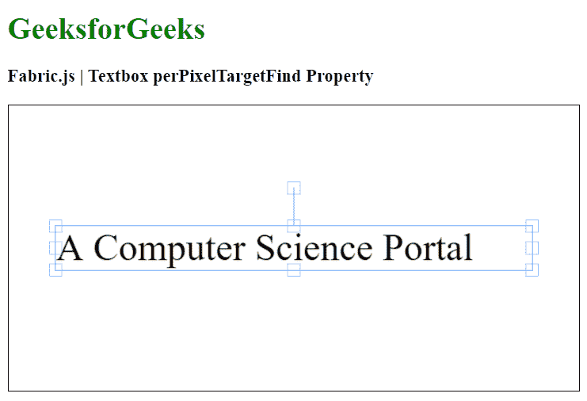

# fabric . js Textbox perpixel targetfind 属性

> 原文:[https://www . geesforgeks . org/fabric-js-textbox-perpixel targetfind-property/](https://www.geeksforgeeks.org/fabric-js-textbox-perpixeltargetfind-property/)

在本文中，我们将看到如何使用 FabricJS 设置画布文本框的 perPixelTargetFind 属性的值。画布文本框是指文本框是可移动的，可以根据需要进行拉伸。此外，文本框可以自定义初始笔画颜色、高度、宽度、填充颜色或笔画宽度。

为了实现这一点，我们将使用一个名为 FabricJS 的 JavaScript 库。导入库之后，我们将在主体标签中创建一个包含文本框的画布块。之后，我们将初始化 FabricJS 提供的 Canvas 和 textbox 的实例，并使用 perpixelltargetfind 属性设置 textbox 的 perpixelltargetfind 属性值，并在 Canvas 上呈现文本框，如下例所示。

**语法:**

```
fabric.Textbox('text', {
   perPixelTargetFind: boolean
});
```

**参数:**该功能接受三个参数，如上所述，描述如下:

*   **perpixelltargetfind:**指定 perpixelltargetfind 属性的字符串值。

**示例:**本示例使用 FabricJS 设置画布文本框的 perPixelTargetFind 属性。

## 超文本标记语言

```
<!DOCTYPE html>
<html>

<head>
    <!-- Adding the FabricJS library -->
    <script src=
"https://cdnjs.cloudflare.com/ajax/libs/fabric.js/3.6.2/fabric.min.js">
    </script>
</head>

<body>
    <h1 style="color: green;">
        GeeksforGeeks
    </h1>

    <h3>
        Fabric.js | Textbox perPixelTargetFind Property
    </h3>

    <canvas id="canvas" width="600" height="300"
        style="border:1px solid #000000">
    </canvas>

    <script>
        // Initiate a Canvas instance 
        var canvas = new fabric.Canvas("canvas");

        // Create a new Textbox instance 
        var text = new fabric.Textbox(
            'A Computer Science Portal', {
            width: 500,
            perPixelTargetFind: true
        });

        // Render the Textbox in canvas 
        canvas.add(text);
        canvas.centerObject(text);
    </script>
</body>

</html>
```

**输出:**

