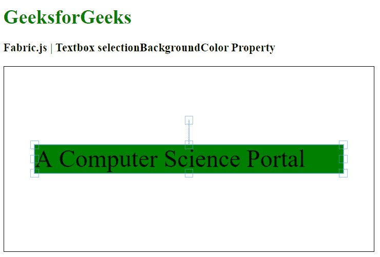

# Fabric.js 文本框选择背景颜色属性

> 原文:[https://www . geesforgeks . org/fabric-js-textbox-selectionbackgroundcolor-property/](https://www.geeksforgeeks.org/fabric-js-textbox-selectionbackgroundcolor-property/)

在本文中，我们将看到如何使用 FabricJS 更改画布 Textbox 的选定背景颜色。画布文本框意味着文本框是可移动的，可以根据需要进行拉伸。此外，当涉及到初始笔画颜色、高度、宽度、填充颜色或笔画宽度时，可以自定义文本框。

为了实现这一点，我们将使用一个名为 FabricJS 的 JavaScript 库。导入库后，我们将在主体标签中创建一个包含文本框的画布块。之后，我们将初始化 FabricJS 提供的 Canvas 和 Textbox 的实例，并使用 selectionBackgroundColor 属性更改 Textbox 的选定背景颜色，并在 Canvas 上呈现 Textbox，如下例所示。

**语法:**

```
fabric.Textbox('text', {
   selectionBackgroundColor: string
});
```

**参数:**该函数接受一个参数，如上所述，如下所述:

*   **selectionBackgroundColor:**指定选择背景的颜色。

**示例:**本示例使用 FabricJS 更改画布文本框的选定背景颜色。请注意，您必须单击对象才能看到其选择背景颜色。

## 超文本标记语言

```
<!DOCTYPE html>
<html>

<head>
    <!-- Adding the FabricJS library -->
    <script src=
"https://cdnjs.cloudflare.com/ajax/libs/fabric.js/3.6.2/fabric.min.js">
    </script>
</head>

<body>
  <h1 style="color: green;">
      GeeksforGeeks
  </h1>

  <h3>
      Fabric.js | Textbox selectionBackgroundColor Property
  </h3>

  <canvas id="canvas" width="600" height="300" 
      style="border:1px solid #000000">
  </canvas>

  <script>
      // Initiate a Canvas instance 
      var canvas = new fabric.Canvas("canvas");

      // Create a new Textbox instance 
      var text = new fabric.Textbox(
          'A Computer Science Portal', {
          width: 500,
          selectionBackgroundColor: "green"
      });

      // Render the Textbox in canvas 
      canvas.add(text);
      canvas.centerObject(text);
  </script>
</body>

</html>
```

**输出:**

