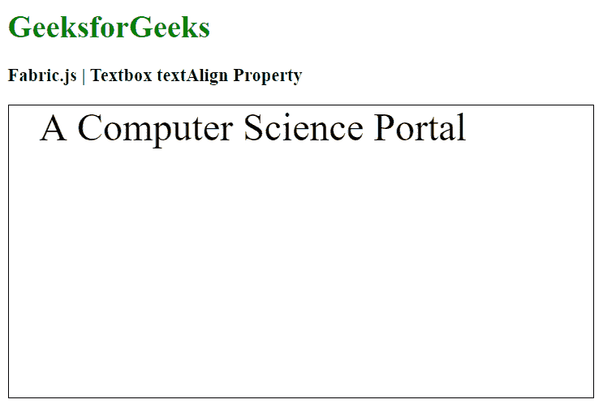
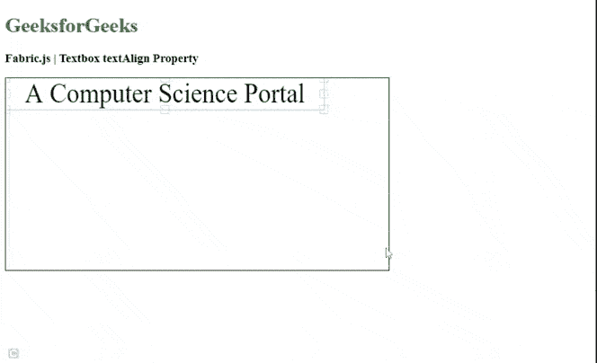

# 织物. js 文本框文本对齐属性

> 原文:[https://www . geesforgeks . org/fabric-js-textbox-textalign-property/](https://www.geeksforgeeks.org/fabric-js-textbox-textalign-property/)

在本文中，我们将看到如何使用 **FabricJS** 设置画布文本框的文本对齐方式。画布意味着所写的文本框是可移动的、可旋转的、可调整大小的，并且可以拉伸。在本文中，我们将设置文本对齐方式。

**方法:**为了使其成为可能，我们将使用一个名为 **FabricJS** 的 JavaScript 库。使用 CDN 导入库后，我们将在包含文本框的主体标签中创建一个画布块。之后，我们将初始化由 **FabricJS** 提供的画布和文本框的实例，并使用 *textAlign* 属性来更改文本对齐方式，并在文本框上呈现画布，如下例所示。

**语法:**

```
fabric.Textbox('text', {
   textAlign: string
});
```

**参数:**该函数接受一个参数，如上所述，如下所述。

*   **文本对齐:**指定文本对齐的值。

**示例:**本示例使用 **FabricJS** 设置画布文本框的文本对齐方式，如下所示。

## 超文本标记语言

```
<!DOCTYPE html>
<html>

<head>
     <!-- Adding the FabricJS library -->
    <script src=
"https://cdnjs.cloudflare.com/ajax/libs/fabric.js/3.6.2/fabric.min.js">
    </script>
</head>

<body>
    <h1 style="color: green;">
        GeeksforGeeks
    </h1>

    <h3>
        Fabric.js | Textbox textAlign Property
    </h3>

    <canvas id="canvas" width="600" height="300" 
        style="border:1px solid #000000">
    </canvas>

    <script>

        // Initiate a Canvas instance 
        var canvas = new fabric.Canvas("canvas");

        // Create a new Textbox instance 
        var text = new fabric.Textbox(
            'A Computer Science Portal', {
            width: 500,
            textAlign: "center"
        });

        // Render the Textbox in canvas 
        canvas.add(text);
    </script>
</body>

</html>
```

**输出:**



