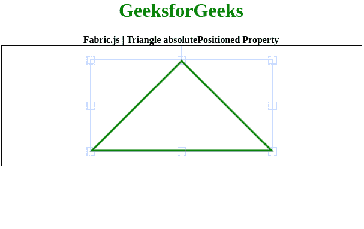

# 织物|三角形绝对定位属性

> 原文:[https://www . geesforgeks . org/fabric-js-triangle-absolute positized-property/](https://www.geeksforgeeks.org/fabric-js-triangle-absolutepositioned-property/)

在本文中，我们将看到如何使用 **FabricJS** 设置画布三角形的**绝对位置**。只有当对象用作剪辑路径时，它才有意义。画布三角形是指三角形是可移动的，可以根据需要拉伸。此外，当涉及到初始笔画颜色、高度、宽度、填充颜色或笔画宽度时，可以自定义三角形。

为了实现这一点，我们将使用一个名为 **FabricJS** 的 JavaScript 库。导入库后，我们将在主体标签中创建一个包含三角形的画布块。之后，我们将初始化由 **FabricJS** 提供的画布和三角形的实例，并使用**绝对定位的**属性设置画布三角形的绝对位置。

**语法:**

```
fabric.Triangle({
    width: number,
    height: number,
    top: number,
    left: number,
    absolutePositioned: boolean
});
```

**参数:**该功能接受三个参数，如上所述，描述如下:

*   **宽度:**指定三角形的宽度。
*   **高度:**指定三角形的高度。
*   **顶部:**指定与边缘顶部的相对距离。
*   **左侧:**指定距离边缘左侧的相对距离。
*   **绝对位置:**指定物体的绝对位置。它包含一个布尔值。

**示例:**本示例使用 FabricJS 设置创建的简单画布三角形的绝对位置。

```
<!DOCTYPE html> 
<html> 

<head> 
    <title> 
        Fabric.js | Triangle absolutePositioned Property
    </title> 

    <!-- Adding the FabricJS library -->
    <script src= 
"https://cdnjs.cloudflare.com/ajax/libs/fabric.js/3.6.2/fabric.min.js"> 
    </script> 
</head> 

<body> 
    <div style="text-align: center;width: 600px;"> 
        <h1 style="color: green;"> 
            GeeksforGeeks 
        </h1> 
        <b> 
            Fabric.js | Triangle absolutePositioned Property 
        </b> 
    </div>
    <canvas id="canvas" width="600" height="200"
        style="border:1px solid #000000"> 
    </canvas> 

    <script> 

        // Initiate a Canvas instance 
        var canvas = new fabric.Canvas("canvas"); 

        // Initiate a triangle instance 
        var triangle = new fabric.Triangle({
            width: 300,
            height: 150,
            fill: '',
            stroke: 'green',
            strokeWidth: 3,
            absolutePositioned: true
        });

        // Render the Triangle in canvas 
        canvas.add(triangle); 
        canvas.centerObject(triangle);
    </script> 
</body> 

</html>
```

**输出:**
