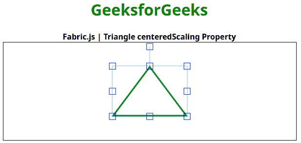

# 织物|三角形中心缩放属性

> 原文:[https://www . geesforgeks . org/fabric-js-triangle-centered scaling-property/](https://www.geeksforgeeks.org/fabric-js-triangle-centeredscaling-property/)

在本文中，我们将看到如何使用 **FabricJS** 启用画布三角形的居中缩放。画布三角形是指三角形是可移动的，可以根据需要拉伸。此外，当涉及到初始笔画颜色、高度、宽度、填充颜色或笔画宽度时，可以自定义三角形。

为了实现这一点，我们将使用一个名为 **FabricJS** 的 JavaScript 库。导入库后，我们将在主体标签中创建一个包含三角形的画布块。之后，我们将初始化由**fabrijs**提供的画布和三角形的实例，并使用**中心缩放**属性启用画布三角形的中心缩放，并在画布上渲染三角形，如下所示。

**语法:**

```
fabric.Triangle({
    width: number,
    height: number,
    centeredscaling: boolean
});
```

**参数:**该功能接受三个参数，如上所述，描述如下:

*   **宽度:**指定三角形的宽度。
*   **高度:**指定三角形的高度。
*   **居中缩放:**此参数定义是启用还是禁用居中缩放。

**示例:**该示例使用 **FabricJS** 来启用画布状三角形的居中缩放，如下所示。在启用居中缩放后，尝试缩放对象，当您缩放它时，它将从四面进行缩放。

## 超文本标记语言

```
<!DOCTYPE html>
<html>

<head>
    <title>
        Fabric.js | Triangle centeredScaling Property
    </title>

    <!-- Adding the FabricJS library -->
    <script src=
"https://cdnjs.cloudflare.com/ajax/libs/fabric.js/3.6.2/fabric.min.js">
    </script>
</head>

<body>
        <div style="text-align: center;width: 600px;">
        <h1 style="color: green;">
            GeeksforGeeks
        </h1>
        <b>
            Fabric.js | Triangle centeredScaling Property
        </b>
        </div>
    <canvas id="canvas" width="600" height="200"
        style="border:1px solid #000000">
    </canvas>

    <script>

        // Initiate a Canvas instance
        var canvas = new fabric.Canvas("canvas");

        // Initiate a triangle instance
        var triangle = new fabric.Triangle({
                        width: 150,
                        height: 100,
                        fill: '',
                        stroke: 'green',
                        strokeWidth: 3,
                        cornerColor: 'blue',
                        centeredScaling: true
        });

        // Render the triangle in canvas
        canvas.add(triangle);
        canvas.centerObject(triangle);
    </script>
</body>

</html>
```

**输出:**

