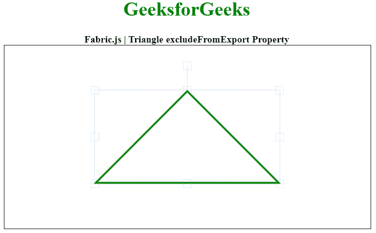

# Fabric.js 三角形 excludeFromExport 属性

> 原文:[https://www . geesforgeks . org/fabric-js-triangle-excludefromexport-property/](https://www.geeksforgeeks.org/fabric-js-triangle-excludefromexport-property/)

在本文中，我们将看到如何使用 FabricJS 禁用画布三角形的导出。画布三角形意味着三角形是可移动的，可以根据需要拉伸。此外，当涉及到初始笔画颜色、高度、宽度、填充颜色或笔画宽度时，可以自定义三角形。

为了实现这一点，我们将使用一个名为 FabricJS 的 JavaScript 库。导入库后，我们将在主体标签中创建一个包含三角形的画布块。之后，我们将初始化 FabricJS 提供的 canvas 和 Triangle 的实例，并使用 excludeFromExport 属性禁用 canvas Triangle 的 canvas click 移动属性，并在 Canvas 上渲染三角形，如下所示。

**语法:**

```
fabric.Triangle({
    width: number,
    height: number,
    excludeFromExport: boolean
});
```

**参数:**该属性接受如上所述的单个参数，如下所述:

*   **exclude defromexport:**当` true '时，对象不在 OBJECT/JSON 中导出。

下面的例子说明了 Fabric.js 中的 excludeFromExport:

**示例:**

## 超文本标记语言

```
<!DOCTYPE html> 
<html> 

<head> 
    <!-- Adding the FabricJS library --> 
    <script src= 
"https://cdnjs.cloudflare.com/ajax/libs/fabric.js/3.6.2/fabric.min.js"> 
    </script> 
</head> 

<body> 
    <center> 
        <h1 style="color: green;"> 
            GeeksforGeeks 
        </h1> 

        <b> 
            Fabric.js | Triangle excludeFromExport Property 
        </b> 

        <canvas id="canvas" width="600" height="300"
            style="border:1px solid #000000"> 
        </canvas> 
    </center> 
    <script> 

        // Initiate a Canvas instance 
        var canvas = new fabric.Canvas("canvas"); 

        // Initiate a triangle instance 
        var triangle = new fabric.Triangle({ 
            width: 300, 
            height: 150, 
            fill: '', 
            stroke: 'green', 
            strokeWidth: 3,
            excludeFromExport : 'false' 
        }); 

        // Render the Triangle in canvas 
        canvas.add(triangle); 
        canvas.centerObject(triangle); 
    </script> 
</body> 

</html>
```

**输出:**

