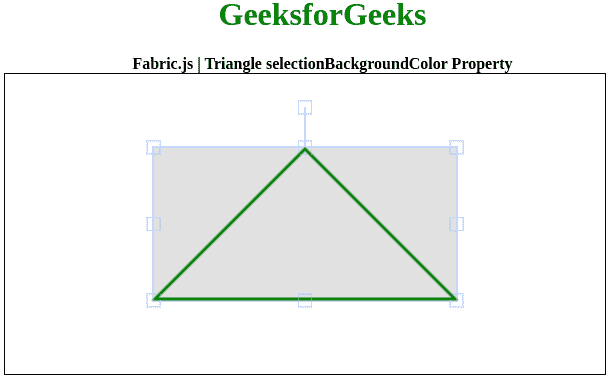

# 织物. js |三角形选择背景颜色属性

> 原文:[https://www . geesforgeks . org/fabric-js-triangle-selectionbackgroundcolor-property/](https://www.geeksforgeeks.org/fabric-js-triangle-selectionbackgroundcolor-property/)

在本文中，我们将看到如何使用 **FabricJS** 更改画布三角形的活动背景颜色。画布三角形是指三角形是可移动的，可以根据需要拉伸。此外，当涉及到初始笔画颜色、高度、宽度、填充颜色或笔画宽度时，可以自定义三角形。

为了实现这一点，我们将使用一个名为 **FabricJS** 的 JavaScript 库。导入库后，我们将在主体标签中创建一个包含三角形的画布块。之后，我们将初始化 FabricJS 提供的画布和三角形实例，并使用**选择背景颜色**属性来更改活动背景颜色，并在三角形上渲染画布，如下例所示。

**语法:**

```
fabric.Triangle({
    width: number,
    height: number,
    selectionBackgroundColor: string
});
```

**参数:**该功能接受三个参数，如上所述，描述如下:

*   **宽度:**指定三角形的宽度。
*   **高度:**指定三角形的高度。
*   **selectionBackgroundColor:**指定活动时背景的颜色。

**示例:**本示例使用 FabricJS 更改画布三角形的活动背景颜色。请注意，我们必须点击文本才能看到活动的背景颜色。

```
<!DOCTYPE html> 
<html> 

<head> 
    <title> 
        Fabric.js | Triangle selectionBackgroundColor Property
    </title> 

    <!-- Adding the FabricJS library -->
    <script src= 
"https://cdnjs.cloudflare.com/ajax/libs/fabric.js/3.6.2/fabric.min.js"> 
    </script> 
</head> 

<body>
    <center>
       <h1 style="color: green;">
        GeeksforGeeks
       </h1>
       <b>
        Fabric.js | Triangle selectionBackgroundColor Property
       </b>
    </center> 
    <canvas id="canvas" width="600" height="300"
        style="border:1px solid #000000"> 
    </canvas> 

    <script> 

        // Initiate a Canvas instance 
        var canvas = new fabric.Canvas("canvas"); 

        // Initiate a triangle instance 
        var triangle = new fabric.Triangle({
            width: 300,
            height: 150,
            fill: '',
            stroke: 'green',
            strokeWidth: 3,
            selectionBackgroundColor: '#e1e1e1'
        });

        // Render the Triangle in canvas 
        canvas.add(triangle); 
        canvas.centerObject(triangle);
    </script> 
</body> 

</html>
```

**输出:**
