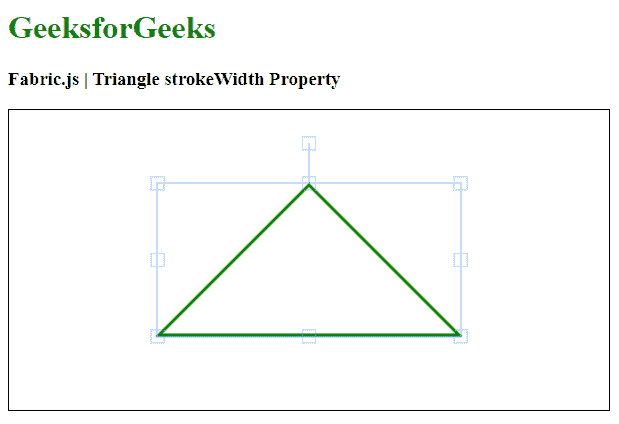

# 织物三角 strokeWidth 属性

> 原文:[https://www . geesforgeks . org/fabric-js-triangle-stroke width-property/](https://www.geeksforgeeks.org/fabric-js-triangle-strokewidth-property/)

在本文中，我们将看到如何使用 FabricJS 设置画布三角形的笔画宽度。画布意味着三角形是可移动的，可以根据需要拉伸。此外，当涉及到初始笔画颜色、填充颜色、笔画宽度或半径时，可以自定义三角形。

**进场:**

*   为了实现这一点，我们将使用一个名为 FabricJS 的 JavaScript 库。
*   使用 CDN 导入库后，我们将在主体标签中创建一个画布块，其中将包含我们的三角形。
*   在此之后，我们将初始化由 FabricJS 提供的 canvas 和 Triangle 的实例，并使用 stroke width 属性设置 canvas Triangle 的笔画宽度，并在 Canvas 上呈现 Triangle，如下例所示。

**语法:**

```
fabric.Triangle({
   width: number,
   height: number,
   stroke: string
   strokeWidth: number
});
```

**参数:**该功能接受三个参数，如上所述，描述如下:

*   **宽度:**指定三角形的宽度。
*   **高度:**指定三角形的高度。
*   **笔画宽度:**指定笔画宽度。

**示例:**本示例使用 FabricJS 设置画布三角形的描边 strokeWidth。

## 超文本标记语言

```
<!DOCTYPE html>
<html>

<head>
    <title>
        Fabric.js | Triangle strokeWidth Property
    </title>

    <!-- Adding the FabricJS library -->
    <script src=
"https://cdnjs.cloudflare.com/ajax/libs/fabric.js/3.6.2/fabric.min.js">
    </script>
</head>

<body>
    <h1 style="color: green;">
        GeeksforGeeks
    </h1>

    <h3>
        Fabric.js | Triangle strokeWidth Property
    </h3>

    <canvas id="canvas" width="600" height="300" 
        style="border:1px solid #000000">
    </canvas>

    <script>

        // Initiate a Canvas instance 
        var canvas = new fabric.Canvas("canvas");

        // Initiate a triangle instance 
        var triangle = new fabric.Triangle({
            width: 300,
            height: 150,
            fill: '',
            stroke: 'green',
            strokeWidth: 3
        });

        // Render the Triangle in canvas 
        canvas.add(triangle);
        canvas.centerObject(triangle);
    </script>
</body>

</html>
```

**输出:**

