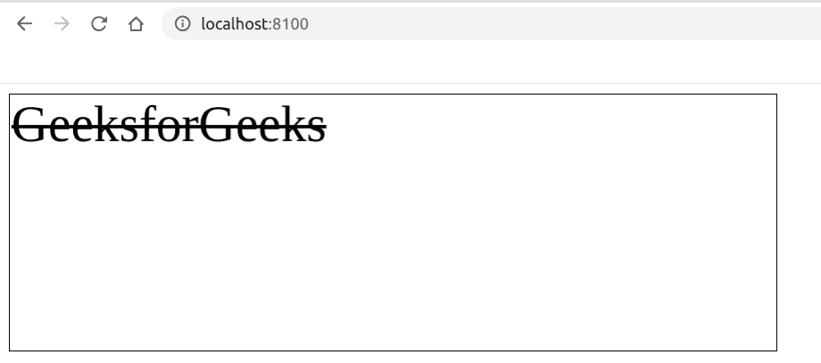

# 如何使用 Fabric.js 向画布类型的文本添加一个换行？

> 原文:[https://www . geeksforgeeks . org/如何添加一条线到画布-类型-文本-使用织物-js/](https://www.geeksforgeeks.org/how-to-add-a-linethrough-to-a-canvas-type-text-using-fabric-js/)

在本文中，我们将看到如何使用 FabricJS 将 linethrough 添加到类似画布的文本中。画布意味着书写的文本是可移动的，可以根据需要拉伸、调整大小和旋转。此外，文本本身不能像文本框一样编辑。
**方法:**为了实现这一点，我们将使用一个名为 FabricJS 的 JavaScript 库。使用 CDN 导入库后，我们将在主体标签中创建一个包含文本的*画布*块。之后，我们将初始化由 FabricJS 提供的 Canvas 和 Text 的实例，并使用 **linethrough** 属性添加一个 linethrough，并在 Text 上呈现 Canvas，如下例所示。
**语法:**

```
fabric.Text(text, linethrough: boolean); 
```

**参数:**该功能接受两个参数，如上所述，描述如下:

*   **文本:**指定要写入的文本。
*   **换行:**指定是启用还是禁用换行文本修饰，默认禁用。

**程序:**我们可以使用 FabricJS 将 linethrough 添加到画布状的文本中，如下所示。

## 超文本标记语言

```
<!DOCTYPE html>
<html>

<head>
    <title>
        Add linethrough to a canvas-type text
    </title>

    <!-- Loading the FabricJS library -->
    <script src=
"https://cdnjs.cloudflare.com/ajax/libs/fabric.js/3.6.2/fabric.min.js">
    </script>
</head>

<body>
    <canvas id="canvas" width="600" height="200"
            style="border:1px solid #000000;">
    </canvas>

    <script>

        // Create a new instance of Canvas
        var canvas = new fabric.Canvas("canvas");

        // Create a new Textbox instance
        var text = new fabric.Text('GeeksforGeeks', {
            linethrough: true
        });

        // Render the text on Canvas
        canvas.add(text);
    </script>
</body>

</html>
```

**输出:**

