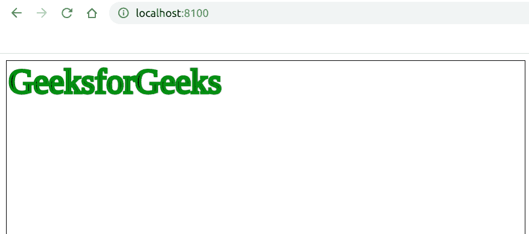

# 如何使用 Fabric.js 添加文本画布的笔画宽度？

> 原文:[https://www . geesforgeks . org/how-add-stroke-width-text-canvas-use-fabric-js/](https://www.geeksforgeeks.org/how-to-add-stroke-width-of-text-canvas-using-fabric-js/)

在本文中，我们将看到如何使用 FabricJS 向文本画布添加笔画宽度。画布意味着书写的文本是可移动的、可旋转的、可调整大小的，并且可以拉伸。但是在本文中，我们将添加一个笔画宽度。此外，文本本身不能像文本框一样编辑。
**方法:**为了实现这一点，我们将使用一个名为 FabricJS 的 JavaScript 库。使用 CDN 导入库后，我们将在主体标签中创建一个包含文本的*画布*块。之后，我们将初始化 FabricJS 提供的 Canvas 和 Text 的实例，并使用 **stroke** 属性创建一个笔画，并进一步使用 **strokeWidth** 属性添加笔画宽度，并在 Text 上渲染 Canvas，如下例所示。

**语法:**

```
 fabric.text(text :string, strokeWidth: number, stroke); 
```

**参数:**该功能接受三个参数，如上所述，描述如下:

*   **文本:**指定文本。
*   **笔画宽度:**指定笔画宽度的大小。
*   **笔画:**指定笔画颜色。

**程序:**本示例使用 FabricJS 添加画布状文本的笔画宽度，如下所示。

## 超文本标记语言

```
<!DOCTYPE html>
<html>

<head>
    <title>
        How to add stroke width to canvas-like
        text using Fabric.js?
    </title>

    <!-- Loading the FabricJS library -->
    <script src=
"https://cdnjs.cloudflare.com/ajax/libs/fabric.js/3.6.2/fabric.min.js">
    </script>
</head>

<body>
    <canvas id="canvas" width="600" height="200"
        style="border:1px solid #000000;">
    </canvas>

    <script>

        // Create a new instance of Canvas
        var canvas = new fabric.Canvas("canvas");

        // Create a new Text instance
        var text = new fabric.Text('GeeksforGeeks', {
            strokeWidth: 3,
            stroke: 'green'
        });

        // Render the text on Canvas
        canvas.add(text);
    </script>
</body>

</html>
```

**输出:**

