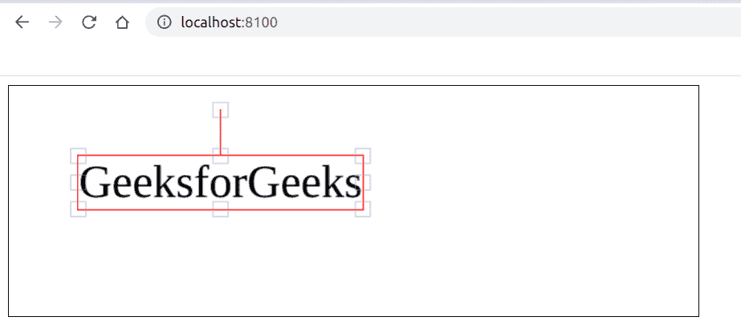

# 如何用 Fabric.js 改变画布文字的边框颜色？

> 原文:[https://www . geesforgeks . org/如何更改画布边框颜色-文本-使用织物-js/](https://www.geeksforgeeks.org/how-to-change-border-color-of-a-canvas-text-using-fabric-js/)

在本文中，我们将看到如何使用 FabricJS 更改类似画布的文本的边框颜色。画布意味着书写的文本是可移动的，可以根据需要拉伸。此外，文本本身不能像文本框一样编辑。
**方法:**为了实现这一点，我们将使用一个名为 FabricJS 的 JavaScript 库。使用 CDN 导入库后，我们将在主体标签中创建一个包含文本的*画布*块。之后，我们将初始化 FabricJS 提供的 Canvas 和 Text 实例，并使用 **borderColor** 属性为文本边框添加颜色，并在文本上渲染 Canvas，如下例所示。此外，请记住，您必须单击文本才能看到文本的边框。
**语法:**

```
 fabric.Text(text, borderColor: String); 
```

**参数:**该功能接受两个参数，如上所述，描述如下:

*   **文本:**指定要写入的文本。
*   **边框颜色:**指定边框的颜色。

**程序:**本示例使用 FabricJS 改变画布状文本的边框颜色。

## 超文本标记语言

```
<!DOCTYPE hyml>
<html>

<head>
    <title>
        change border-color of a canvas-type text
    </title>

    <!-- Loading the FabricJS library -->
    <script src=
"https://cdnjs.cloudflare.com/ajax/libs/fabric.js/3.6.2/fabric.min.js">
    </script>
</head>

<body>
    <canvas id="canvas" width="600" height="200"
            style="border:1px solid #000000;">
    </canvas>

    <script>

        // Create a new instance of Canvas
        var canvas = new fabric.Canvas("canvas");

        // Create a new Textbox instance
        var text = new fabric.Text('GeeksforGeeks', {
            borderColor: 'red',
        });

        // Render the Textbox on Canvas
        canvas.add(text);
    </script>
</body>

</html>
```

**输出:**

