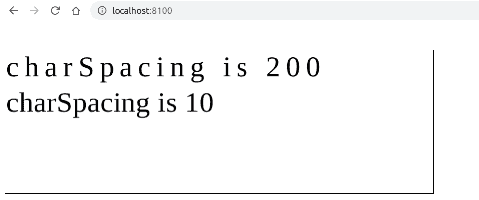

# 如何使用 Fabric.js 改变文本画布的字符间距？

> 原文:[https://www . geesforgeks . org/如何更改文本的字符间距-画布-使用织物-js/](https://www.geeksforgeeks.org/how-to-change-character-spacing-of-text-canvas-using-fabric-js/)

在本文中，我们将看到如何使用 FabricJS 更改文本画布的字符间距。画布意味着书写的文本是可移动的，可以根据需要拉伸。此外，文本本身不能像文本框一样编辑。
**方法:**为了实现这一点，我们将使用一个名为 FabricJS 的 JavaScript 库。使用 CDN 导入库后，我们将在主体标签中创建一个包含文本的*画布*块。之后，我们将初始化 FabricJS 提供的 Canvas 和 Text 的实例，并使用 **charSpacing** 属性来更改字符之间的间距，并在 Text 上渲染 Canvas，如下例所示。

**语法:**

```
 fabric.Text(text, charSpacing: number); 
```

**参数:**该函数接受两个参数，如上所述，如下所述:

*   **文本:**指定要写入的文本。
*   **字符间距:**指定字符之间的间距。

**程序:**本例使用 FabricJS 改变文本画布的字符间距-。

## 超文本标记语言

```
<!DOCTYPE html>
<html>

<head>
    <title>
        How to change character spacing
        of text canvas using Fabric.js?
    </title>

    <!-- Loading the FabricJS library -->
    <script src=
"https://cdnjs.cloudflare.com/ajax/libs/fabric.js/3.6.2/fabric.min.js">
    </script>
</head>

<body>
    <canvas id="canvas" width="600" height="200"
        style="border:1px solid #000000;">
    </canvas>

    <script>

        // Create a new instance of Canvas
        var canvas = new fabric.Canvas("canvas");

        // Create a new Textbox instance
        var first_text = new fabric.Text(
                'charSpacing is 200', {
            charSpacing: 200
        });

        // Create a new Textbox instance
        var second_text = new fabric.Text(
                'charSpacing is 10', {
            charSpacing: 10,
            top: 50
        });

        // Render both of the Textbox on Canvas
        canvas.add(first_text);
        canvas.add(second_text);
    </script>
</body>

</html>
```

**输出:**

