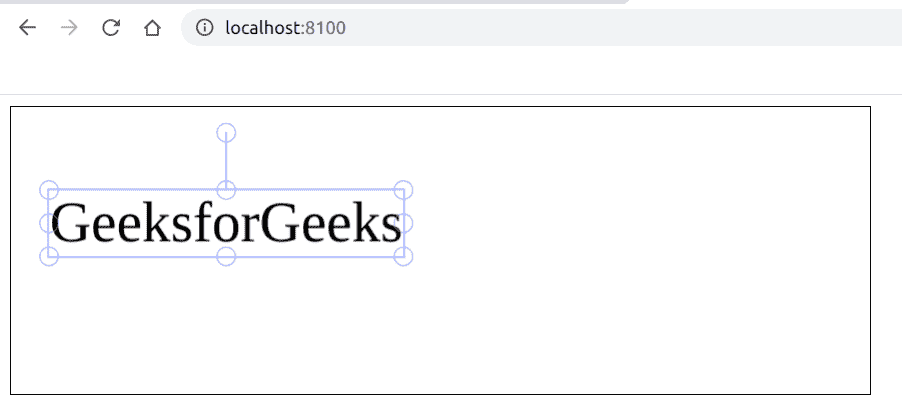

# 如何使用 Fabric.js 改变画布型文本的边角样式？

> 原文:[https://www . geesforgeks . org/如何更改画布一角样式文本使用织物-js/](https://www.geeksforgeeks.org/how-to-change-corner-style-of-a-canvas-type-text-using-fabric-js/)

在本文中，我们将看到如何在 JavaScript 中改变类似画布的文本的角样式。画布意味着书写的文本是可移动的，可以根据需要拉伸。此外，文本本身不能像文本框一样编辑。文本的角是可以调整文本大小的点。
**方法:**为了实现这一点，我们将使用一个名为 FabricJS 的 JavaScript 库。使用 CDN 导入库后，我们将在主体标签中创建一个画布块，其中将包含我们的文本。在此之后，我们将初始化由 FabricJS 提供的画布和文本的实例，并使用**角样式**属性来更改角样式，并在文本上渲染画布，如下例所示。请注意，你必须点击文本才能看到它的角落。

**语法:**

```
fabric.Text(text, cornerStyle: string); 
```

**参数:**该函数接受两个参数，如上所述，如下所述:

*   **文本:**指定要写入的文本。
*   **角样式:**指定角样式，可以是*【矩形】*或*【圆形】*，其中*【矩形】*为默认样式。

**程序:**本示例使用 FabricJS 改变画布状文本的边角样式。

## 超文本标记语言

```
<!DOCTYPE html>
<html>

<head>
    <title>
        How to change corner style of a
        canvas-type text with JavaScript?
    </title>

    <!-- Loading the FabricJS library -->
    <script src=
"https://cdnjs.cloudflare.com/ajax/libs/fabric.js/3.6.2/fabric.min.js">
     </script>
</head>

<body>
    <canvas id="canvas" width="600" height="200"
            style="border:1px solid #000000;">
    </canvas>

    <script>

        // Create a new instance of Canvas
        var canvas = new fabric.Canvas("canvas");

        // Create a new Textbox instance
        var text = new fabric.Text('GeeksforGeeks', {
            cornerStyle: 'circle'
        });

        // Render the Textbox on Canvas
        canvas.add(text);
    </script>
</body>

</html>
```

**输出:**

