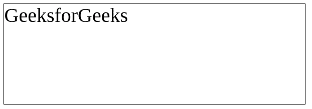

# 如何使用 Fabric.js 更改文本画布的字体系列？

> 原文:[https://www . geesforgeks . org/how-change-font-family-a-text-canvas-use-fabric-js/](https://www.geeksforgeeks.org/how-to-change-font-family-of-a-text-canvas-using-fabric-js/)

在本文中，我们将看到如何使用 FabricJS 更改文本画布的字体系列。画布意味着书写的文本是可移动的，可以根据需要拉伸。此外，文本本身不能像文本框一样编辑。
为了实现这一点，我们将使用一个名为 FabricJS 的 JavaScript 库。使用 CDN 导入库后，我们将在主体标签中创建一个包含文本的**画布**块。之后，我们将初始化由 **FabricJS** 提供的画布和文本的实例，并使用 **fontFamily** 属性来更改字体系列并在文本上渲染画布，如下例所示。

**语法:**

```html
fabric.Text(text, fontFamily: string);
```

**参数:**该函数接受两个参数，如上所述，如下所述:

*   **文本:**指定要写入的文本。
*   **字体系列:**指定字体系列。

**程序:**我们可以使用 FabricJS 来更改画布状文本的字体系列，如下所示:

## 超文本标记语言

```html
<!DOCTYPE hyml>
<html>

<head>
    <title>
        How to change font-family of a
        canvas-type text with Fabtic.js?
    </title>

    <!-- Loading the FabricJS library -->
    <script src=
"https://cdnjs.cloudflare.com/ajax/libs/fabric.js/3.6.2/fabric.min.js">
    </script>

    <!-- Loading the Pacifico font family -->
    <link href=
 "https://fonts.googleapis.com/css2?family=Pacifico&display=swap"
          rel="stylesheet">

</head>

<body>
    <center>
        <canvas id="canvas"
                width="600"
                height="200"
                style="border:1px solid #000000;">
        </canvas>

        <script>

            // Create a new instance of Canvas
            var canvas = new fabric.Canvas("canvas");

            // Create a new Textbox instance
            var text = new fabric.Text('GeeksforGeeks', {
                fontFamily: 'Pacifico'
            });

            // Render the Textbox on Canvas
            canvas.add(text);
        </script>
    </center>
</body>

</html>
```

**输出:**点击运行 IDE 按钮后，您必须再次点击运行按钮来更改字体系列。

