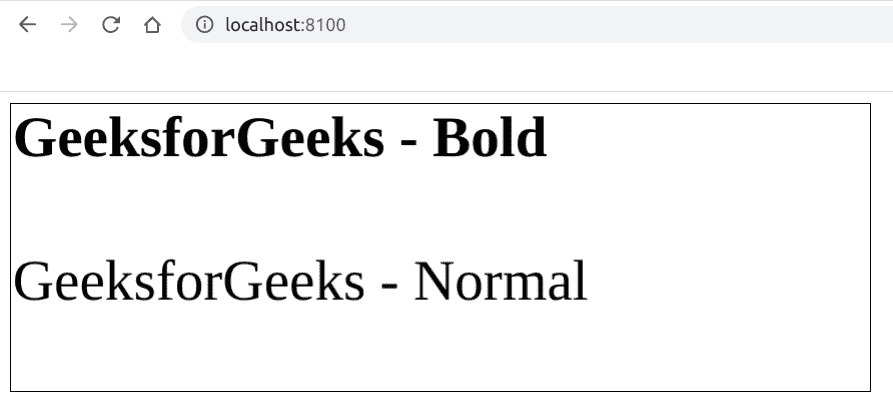

# 如何使用 Fabric.js 更改画布类型文本的字体粗细？

> 原文:[https://www . geeksforgeeks . org/how-change-font-weight-of-a-canvas-type-text-use-fabric-js/](https://www.geeksforgeeks.org/how-to-change-font-weight-of-a-canvas-type-text-using-fabric-js/)

在本文中，我们将看到如何使用 FabricJS 改变类似画布的文本的字体粗细。画布意味着书写的文本是可移动的，可以根据需要拉伸。此外，文本本身不能像文本框一样编辑。
**方法:**为此，我们将使用一个名为 FabricJS 的 JavaScript 库。使用 CDN 导入库后，我们将在主体标签中创建一个包含文本的*画布*块。之后，我们将初始化 FabricJS 提供的 Canvas 和 Text 的实例，并使用 **fontWeight** 属性来更改字体粗细，并在 Text 上渲染 Canvas，如下例所示。

**语法:**

```
 fabric.Text(text, fontWeight: number|string); 
```

**参数:**该函数接受两个参数，如上所述，如下所述:

*   **文本:**指定要写入的文本。
*   **字体粗细:**指定字体粗细，可以是*粗体*、*普通*、 *400* 、 *500* 等。

**程序:**本示例使用 FabricJS 改变画布状文本的字体粗细。

## 超文本标记语言

```
<!DOCTYPE html>
<html>

<head>
    <title>
        change font-weight of a canvas-type
        text with JavaScript
    </title>

    <!-- Loading the FabricJS library -->
    <script src=
"https://cdnjs.cloudflare.com/ajax/libs/fabric.js/3.6.2/fabric.min.js">
    </script>
</head>

<body>
    <canvas id="canvas" width="600" height="200"
        style="border:1px solid #000000;">
    </canvas>

    <script>

        // Create a new instance of Canvas
        var canvas = new fabric.Canvas("canvas");

        // Create a new Textbox instance
        var bold_text = new fabric.Text('GeeksforGeeks - Bold', {
            fontWeight: 'bold'
        });

        // Create another new Textbox instance
        var normal_text = new fabric.Text('GeeksforGeeks - Normal', {
            fontWeight: 'normal',
            top: 100
        });

        // Render all the Textboxes on Canvas
        canvas.add(normal_text);
        canvas.add(bold_text);
    </script>
</body>

</html>
```

**输出:**

