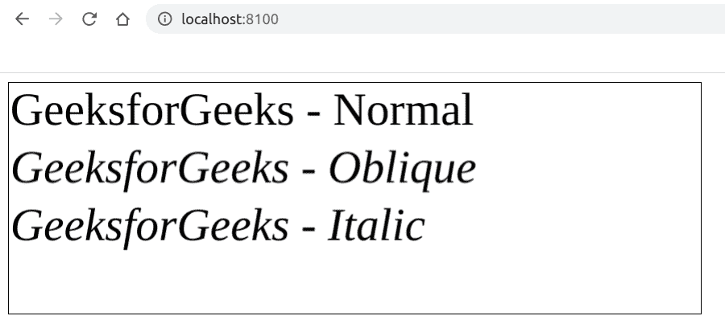

# 如何使用 Fabric.js 更改文本画布的字体样式？

> 原文:[https://www . geeksforgeeks . org/如何使用织物改变文本画布的字体风格-js/](https://www.geeksforgeeks.org/how-to-change-the-font-style-of-a-text-canvas-using-fabric-js/)

在本文中，我们将看到如何使用 FabricJS 更改文本画布的字体样式。画布意味着书写的文本是可移动的，可以根据需要拉伸。此外，文本本身不能像文本框一样编辑。
**方法:**为了实现这一点，我们将使用一个名为 FabricJS 的 JavaScript 库。使用 CDN 导入库后，我们将在主体标签中创建一个包含文本的*画布*块。之后，我们将初始化 FabricJS 提供的 Canvas 和 Text 的实例，并使用 **fontStyle** 属性来更改字体样式，并在 Text 上呈现 Canvas，如下例所示。
**语法:**

```
fabric.Text(text, fontStyle: number); 
```

**参数:**该功能接受两个参数，如上所述，描述如下:

*   **文本:**指定要写入的文本。
*   **字体样式:**指定字体样式，可以是*普通*、*斜体字*或*斜体字*，其中*普通*为默认样式。

**程序:**本示例使用 FabricJS 更改文本画布的字体样式。

## 超文本标记语言

```
<!DOCTYPE html>
<html>

<head>
    <title>
        How to change the font style of
        a text canvas using Fabric.js?
    </title>

    <!-- Loading the FabricJS library -->
    <script src=
"https://cdnjs.cloudflare.com/ajax/libs/fabric.js/3.6.2/fabric.min.js">
    </script>
</head>

<body>
    <canvas id="canvas" width="600" height="200"
        style="border:1px solid #000000;">
    </canvas>

    <script>

        // Create a new instance of Canvas
        var canvas = new fabric.Canvas("canvas");

        // Create a new Textbox instance
        var normaltext = new fabric.Text(
                'GeeksforGeeks - Normal', {
            fontStyle: 'normal'
        });

        // Create another new Textbox instance
        var obliquetext = new fabric.Text(
                'GeeksforGeeks - Oblique', {
            fontStyle: 'oblique',
            top: 50
        });

        // Create another new Textbox instance
        var italictext = new fabric.Text(
                'GeeksforGeeks - Italic', {
            fontStyle: 'italic',
            top: 100
        });

        // Render all the Textboxes on Canvas
        canvas.add(normaltext);
        canvas.add(obliquetext);
        canvas.add(italictext);
    </script>
</body>

</html>
```

**输出:**

