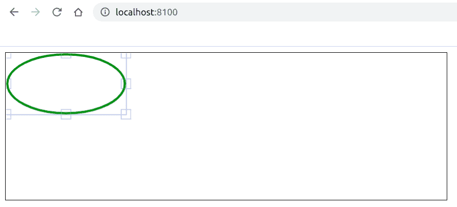

# 如何使用 Fabric.js 创建画布椭圆？

> 原文:[https://www . geesforgeks . org/如何创建画布-椭圆-使用织物-js/](https://www.geeksforgeeks.org/how-to-create-a-canvas-ellipse-using-fabric-js/)

在本文中，我们将看到如何使用 FabricJS 创建画布椭圆。画布意味着椭圆是可移动的，可以根据需要拉伸。此外，当涉及到初始笔画颜色、填充颜色、笔画宽度或半径时，可以定制椭圆。

**方法:**为了实现这一点，我们将使用一个名为 FabricJS 的 JavaScript 库。使用 CDN 导入库后，我们将在主体标签中创建一个包含我们的椭圆的*画布*块。之后，我们将初始化由 FabricJS 提供的 Canvas 和 Ellipse 的实例，并在 Canvas 上渲染 Ellipse，如下例所示。

**语法:**

```
 fabric.Ellipse({
            rx: number,
            ry: number,
            radius: number,
            fill: string,
            stroke: string,
            strokeWidth: int
        }); 
```

**参数:**该功能接受六个参数，如上所述，描述如下:

*   **rx:** 指定水平半径。
*   **ry:** 指定垂直半径。
*   **半径:**指定半径。
*   **填充:**指定填充颜色。
*   **笔画:**指定笔画颜色。
*   **笔画宽度:**指定笔画的宽度。

**程序:**本示例使用 FabricJS 创建简单的可编辑画布状椭圆，如下所示:

```
<!DOCTYPE hyml>
<html>

<head>
    <title>
        How to create a canvas-type 
        ellipse with JavaScript?
    </title>

    <!-- Loading the FabricJS library -->
    <script src=
"https://cdnjs.cloudflare.com/ajax/libs/fabric.js/3.6.2/fabric.min.js">
    </script>
</head>

<body>
    <canvas id="canvas" 
            width="600" height="200" 
            style="border:1px solid #000000">
    </canvas>

    <script>

        // Initiate a Canvas instance
        var canvas = new fabric.Canvas("canvas");

        // Initiate a Ellipse instance
        var ellipse = new fabric.Ellipse({
            rx: 80,
            ry: 40,
            fill: '',
            stroke: 'green',
            strokeWidth: 3
        });

        // Render the Ellipse in canvas
        canvas.add(ellipse);
    </script>
</body>

</html>
```

**输出:**
