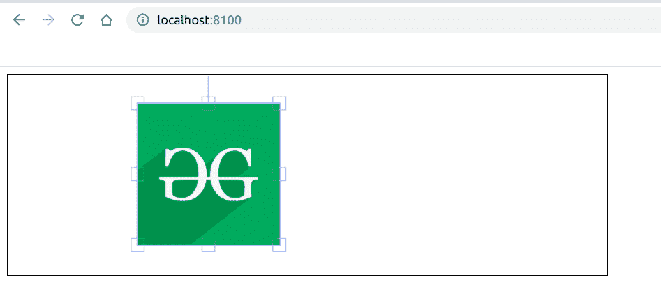

# 如何使用 Fabric.js 创建画布图像？

> 原文:[https://www . geesforgeks . org/how-to-create-a-canvas-image-use-fabric-js/](https://www.geeksforgeeks.org/how-to-create-a-canvas-image-using-fabric-js/)

在本文中，我们将看到如何在 JavaScript 中创建一个类似画布的图像。像画布一样的图像意味着图像是可移动的，可以根据需要调整大小。
**方法:**为了实现这一点，我们将使用一个名为 FabricJS 的 JavaScript 库。导入库后，我们将在主体标签中创建一个包含图像的*画布*块。此外，我们将创建一个 *img* 元素，其中包含要添加到画布内部的图像，并将样式属性设置为*显示:无；*因为我们不希望图像在画布之外可见。在此之后，我们将初始化由 FabricJS 提供的 Canvas 和 Image 的实例，并在 Canvas 上渲染图像，如下例所示。
**语法:**

```html
 fabric.Image( image_element ); 
```

**示例:**本示例使用 FabricJS 创建简单的可编辑画布图像。

## 超文本标记语言

```html
<!DOCTYPE html>
<html>

<head>
    <title>
        How to create a canvas-type
        image with JavaScript?
    </title>

    <!-- Loading the FabricJS library -->
    <script src=
"https://cdnjs.cloudflare.com/ajax/libs/fabric.js/3.6.2/fabric.min.js">
    </script>
</head>

<body>
    <canvas id="canvas" width="600" height="200"
        style="border:1px solid #000000">
    </canvas>

    <!-- Add the image to be used in the canvas
        and hide it here because only need it
        inside the canvas -->
    

    <script>
        // Initiate a Canvas instance
        var canvas = new fabric.Canvas("canvas");

        // Get the image element
        var image = document.getElementById('my-image');

        // Initiate a Fabric instance
        var fabricImage = new fabric.Image(image);

        // Add the image to canvas
        canvas.add(fabricImage);
    </script>
</body>

</html>
```

**输出:**

