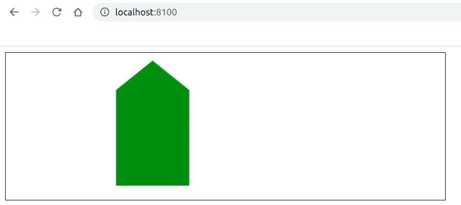

# 如何使用 Fabric.js 创建画布多边形？

> 原文:[https://www . geesforgeks . org/如何使用织物创建画布多边形-js/](https://www.geeksforgeeks.org/how-to-create-a-canvas-polygon-using-fabric-js/)

在本文中，我们将看到如何使用 FabricJS 创建画布多边形。画布意味着多边形是可移动的，可以根据需要拉伸。此外，当涉及到初始填充颜色及其坐标时，可以自定义多边形。

**方法:**为了实现这一点，我们将使用一个名为 FabricJS 的 JavaScript 库。导入库后，我们将在主体标签中创建一个包含我们的多边形的*画布*块。之后，我们将初始化由 FabricJS 提供的 Canvas 和 Polygon 实例，并在 Canvas 实例上渲染 Polygon 实例，如下例所示。

**语法:**

```
 fabric.Polygon(points, options); 
```

**参数:**该函数接受两个参数，如上所述，如下所述:

*   **点:**指定多边形所有点的起始和结束坐标。
*   **选项:**指定要应用的附加选项。

**程序:**本示例使用 FabricJS 创建简单的可编辑画布多边形。

```
<!DOCTYPE html>
<html>

<head>
    <title>
        How to create a canvas polygon using Fabric.js?
    </title>

    <!-- Loading the FabricJS library -->
    <script src=
"https://cdnjs.cloudflare.com/ajax/libs/fabric.js/3.6.2/fabric.min.js">
    </script>
</head>

<body>
    <canvas id="canvas" 
            width="600" 
            height="200" 
            style="border:1px solid #000000;">
    </canvas>

    <script>

        // Initiate a Canvas instance
        var canvas = new fabric.Canvas("canvas");

        // Initiate a polygon instance
        var polygon = new fabric.Polygon([
        { x: 200, y: 10 },
        { x: 250, y: 50 },
        { x: 250, y: 180},
        { x: 150, y: 180},
        { x: 150, y: 50 }], {
            fill: 'green'
        });

        // Render the polygon in canvas
        canvas.add(polygon);
    </script>
</body>

</html>
```

**输出:**
