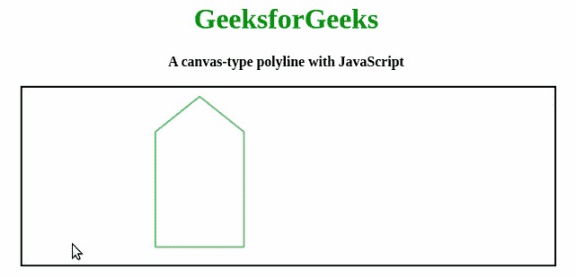

# 如何使用 Fabric.js 创建折线画布？

> 原文:[https://www . geesforgeks . org/如何创建折线-画布-使用织物-js/](https://www.geeksforgeeks.org/how-to-create-a-polyline-canvas-using-fabric-js/)

在本文中，我们将看到如何使用 Fabric.js 创建类似画布的折线。画布意味着折线是可移动的，并且可以根据需要进行拉伸。此外，在初始填充颜色、描边颜色及其坐标方面，可以自定义多段线。

为了实现这一点，我们将使用一个名为 FabricJS 的 JavaScript 库。导入库之后，我们将在主体标签中创建一个**画布**块，它将包含我们的折线。之后，我们将初始化由 FabricJS 提供的画布和折线实例，并在画布实例上渲染折线实例，如下例所示。

**语法:**

```html
fabric.Polyline(points, options);
```

**参数:**该函数接受两个参数，如上所述，如下所述:

*   **点:**保存折线所有点的起点和终点坐标。
*   **选项:**保存要应用的附加选项。

以下示例实现了上述方法:

**示例:**本示例使用 FabricJS 创建简单的可编辑折线画布。

```html
<!DOCTYPE html>
<html>

<head>
    <title>
        How to create a polyline canvas using Fabric.js ?
    </title>

    <!-- Loading the FabricJS library -->
    <script src=
"https://cdnjs.cloudflare.com/ajax/libs/fabric.js/3.6.2/fabric.min.js">
    </script>
</head>

<body>
    <center>
    <h1  style="color:green;">GeeksforGeeks</h1>
    <b>
        A canvas-type polyline with JavaScript
    </b>
    <br>
    <br>
    <canvas id="canvas"
            width="600"
            height="200" 
            style="border: 2px solid black;">
    </canvas>
    <script>

        // Initiate a Canvas instance
        var canvas = new fabric.Canvas("canvas");

        // Initiate a polyline instance
        var polyline = new fabric.Polyline([{
            x: 200,
            y: 10
        }, {
            x: 250,
            y: 50
        }, {
            x: 250,
            y: 180
        }, {
            x: 150,
            y: 180
        }, {
            x: 150,
            y: 50
        }, {
            x: 200,
            y: 10
        }], {
            fill: 'white',
            stroke: 'green'
        });

        // Render the polyline in canvas
        canvas.add(polyline);
    </script>
</body>

</html>
```

**输出:**
