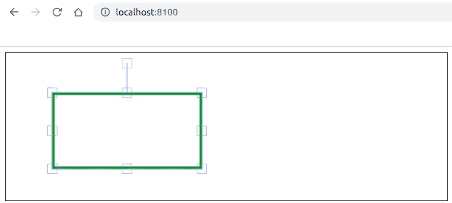

# 如何使用 Fabric.js 创建矩形画布？

> 原文:[https://www . geeksforgeeks . org/如何创建矩形-画布-使用织物-js/](https://www.geeksforgeeks.org/how-to-create-a-rectangle-canvas-using-fabric-js/)

在本文中，我们将使用 FabricJS 创建一个画布矩形。画布矩形意味着矩形是可移动的，可以根据需要拉伸。此外，当涉及到初始笔画颜色、高度、宽度、填充颜色或笔画宽度时，可以定制矩形。

**方法:**为了实现这一点，我们将使用一个名为 FabricJS 的 JavaScript 库。导入库后，我们将在主体标签中创建一个包含矩形的*画布*块。之后，我们将初始化由 FabricJS 提供的 Canvas 和 Rect 的实例，并在 Canvas 实例上呈现 Rect 实例，如下例所示。

**语法:**

```
fabric.Rect({
    width: number,
    height: number,
    fill: string,
    stroke: string,
    strokeWidth: int
}); 
```

**参数:**该功能接受五个参数，如上所述，描述如下:

*   **宽度:**指定矩形的宽度。
*   **高度:**指定矩形的高度。
*   **填充:**指定填充颜色。
*   **笔画:**指定笔画颜色。
*   **笔画宽度:**指定笔画的宽度。

**示例:**本示例使用 FabricJS 创建简单的可编辑画布矩形。

```
<!DOCTYPE html>
<html>

<head>
    <title>
        How to create a rectangle
        canvas using Fabric.js ?
    </title>

    <!-- Adding the FabricJS library -->
    <script src=
"https://cdnjs.cloudflare.com/ajax/libs/fabric.js/3.6.2/fabric.min.js">
    </script>
</head>

<body>
    <canvas id="canvas" width="600" height="200"
        style="border:1px solid #000000">
    </canvas>

    <script>

        // Initiate a Canvas instance
        var canvas = new fabric.Canvas("canvas");

        // Initiate a Rect instance
        var rectangle = new fabric.Rect({
            width: 200,
            height: 100,
            fill: '',
            stroke: 'green',
            strokeWidth: 3
        });

        // Render the Rect in canvas
        canvas.add(rectangle);
    </script>
</body>

</html>
```

**输出:**
