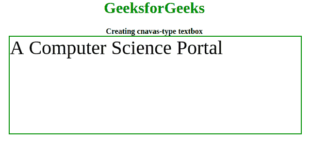

# 如何使用 Fabric.js 创建一个简单的可编辑画布文本框？

> 原文:[https://www . geeksforgeeks . org/如何创建-简单-可编辑-画布-文本框-使用-fabric-js/](https://www.geeksforgeeks.org/how-to-create-a-simple-editable-canvas-textbox-using-fabric-js/)



在本文中，我们将使用 Fabric.js 创建一个画布文本框。画布意味着在文本框中编写的文本是可移动的，并且可以根据需要进行拉伸。此外，文本本身也可以编辑成其他任何东西，因为它是一个文本框。
**创建结构:**为了实现这一点，我们将使用一个名为 **FabricJS** 的 JavaScript 库，并创建一个基本的画布结构。

*   **包含 FabricJS 库:**使用 CDN 导入库

*   **创建画布结构的 HTML 代码:**我们将在主体标签中创建一个**画布**块，它将包含我们的文本框。之后，我们将初始化由 FabricJS 提供的 Canvas 和 Textbox 的实例，并在 Textbox 上呈现 Canvas，如下例所示。

## 超文本标记语言

```html
<!DOCTYPE hyml>
<html>

<head>

</head>

<body>
    <center>
        <h1>GeeksforGeeks</h1>
        <b>Creating canvas-type textbox</b>
        <canvas id="canvas"
                width="600"
                height="200">
        </canvas>
    </center>

</body>
</html>                   
```