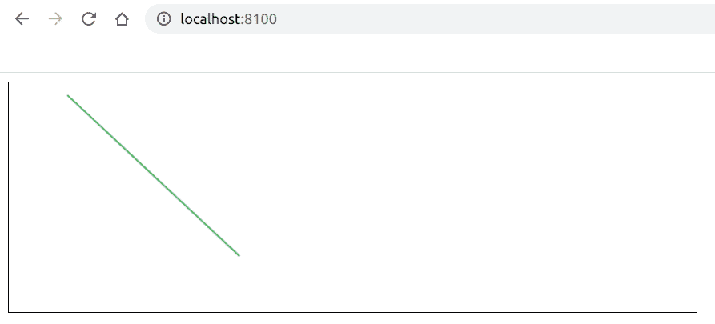

# 如何使用 Fabric.js 创建画布线？

> 原文:[https://www . geesforgeks . org/how-create-canvas-line-use-fabric-js/](https://www.geeksforgeeks.org/how-to-create-canvas-line-using-fabric-js/)

在本文中，我们将看到如何使用 FabricJS 创建画布线。帆布线意味着线是可移动的，可以根据您的要求拉伸。此外，当涉及到初始笔画颜色及其开始和结束坐标时，可以自定义线条。
**方法:**为了实现这一点，我们将使用一个名为 FabricJS 的 JavaScript 库。导入库后，我们将在主体标签中创建一个包含我们的行的*画布*块。之后，我们将初始化由 FabricJS 提供的 Canvas 和 Line 实例，并在 Canvas 实例上呈现 Line 实例，如下例所示。
**语法:**

```
fabric.Line(points, options); 
```

**参数:**该功能接受两个参数，如上所述，描述如下:

*   **点:**指定直线的起点和终点坐标，顺序为起点 x 坐标、起点 y 坐标、终点 x 坐标和终点 y 坐标。
*   **选项:**指定要应用的附加选项。

**示例:**我们可以使用 FabricJS 创建简单的可编辑画布线。

## 超文本标记语言

```
<!DOCTYPE html>
<html>

<head>
    <title>
        How to create canvas
        line using Fabric.js?
    </title>

    <!-- Loading the FabricJS library -->
    <script src=
"https://cdnjs.cloudflare.com/ajax/libs/fabric.js/3.6.2/fabric.min.js">
    </script>
</head>

<body>
    <canvas id="canvas" width="600" height="200"
        style="border:1px solid #000000;">
    </canvas>

    <script>

        // Initiate a Canvas instance
        var canvas = new fabric.Canvas("canvas");

        // Initiate a line instance
        var line = new fabric.Line([50, 10, 200, 150], {
            stroke: 'green'
        });

        // Render the rectangle in canvas
        canvas.add(line);
    </script>
</body>

</html>
```

