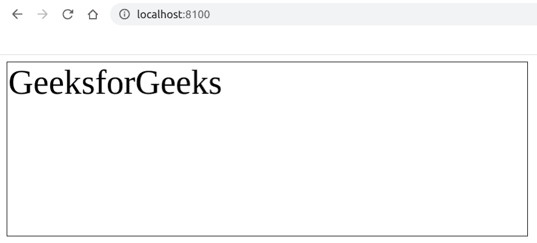

# 如何禁用使用 Fabric.js 修改文本画布？

> 原文:[https://www . geeksforgeeks . org/如何禁用修改文本-画布-使用织物-js/](https://www.geeksforgeeks.org/how-to-disable-the-modification-of-text-canvas-using-fabric-js/)

在本文中，我们将看到如何使用 FabricJS 禁用文本画布的修改。画布意味着书写的文本是可移动的、可旋转的、可调整大小的，并且可以拉伸。但是在本文中，我们将禁用修改。此外，文本本身不能像文本框一样编辑。
**方法:**为了实现这一点，我们将使用一个名为 FabricJS 的 JavaScript 库。使用 CDN 导入库后，我们将在主体标签中创建一个包含文本的*画布*块。之后，我们将初始化由 FabricJS 提供的 Canvas 和 Text 的实例，并使用**可选的**属性来禁用修改，并在 Text 上呈现 Canvas，如下例所示。
**语法:**

```
 fabric.Text(text, selectable: boolean); 
```

**参数:**该功能接受两个参数，如上所述，描述如下:

*   **文本:**指定要写入的文本。
*   **可选:**指定是否允许修改，默认为真。

**程序:**我们可以使用 FabricJS 来禁用画布状文本的修改，如下所示。

## 超文本标记语言

```
<!DOCTYPE html>
<html>

<head>
    <title>
        Disable the modification of canvas-type text
    </title>

    <!-- Loading the FabricJS library -->
    <script src=
"https://cdnjs.cloudflare.com/ajax/libs/fabric.js/3.6.2/fabric.min.js">
    </script>
</head>

<body>
    <canvas id="canvas" width="600" height="200"
        style="border:1px solid #000000;">
    </canvas>

    <script>
        // Create a new instance of Canvas
        var canvas = new fabric.Canvas("canvas");

        // Create a new Text instance
        var text = new fabric.Text('GeeksforGeeks', {
            selectable: false
        });

        // Render the text on Canvas
        canvas.add(text);
    </script>
</body>

</html>
```

**输出:**

