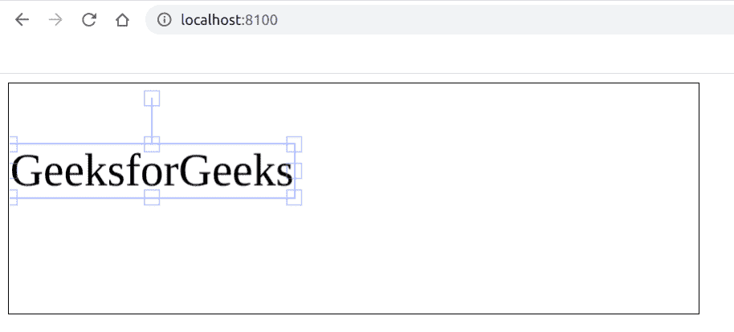

# 如何使用 Fabric.js 锁定画布文字的水平移动？

> 原文:[https://www . geesforgeks . org/如何锁定画布的水平移动-使用织物的文本-js/](https://www.geeksforgeeks.org/how-to-lock-the-horizontal-movement-of-a-canvas-text-using-fabric-js/)

在本文中，我们将看到如何使用 FabricJS 锁定类似画布的文本的水平移动。画布意味着书写的文本是可移动的、可旋转的、可调整大小的，并且可以根据需要拉伸，但是我们将锁定水平移动，这样它就不能向左或向右移动。此外，文本本身不能像文本框一样编辑。
**方法:**为了实现这一点，我们将使用一个名为 FabricJS 的 JavaScript 库。使用 CDN 导入库后，我们将在主体标签中创建一个包含文本的*画布*块。之后，我们将初始化 FabricJS 提供的 Canvas 和 Text 的实例，并使用 **lockMovementX** 属性来锁定水平移动，并在 Text 上渲染 Canvas，如下例所示。
**语法:**

```
 fabric.Text(text, lockMovementX: boolean); 
```

**参数:**该功能接受两个参数，如上所述，描述如下:

*   **文本:**指定要写入的文本。
*   **lockMovementX:** 指定是启用还是禁用水平移动锁定，默认禁用。

**程序:**我们可以使用 FabricJS 来锁定画布状文本的水平移动，如下图所示。

## 超文本标记语言

```
<!DOCTYPE html>
<html>

<head>
    <title>
        lock horizontal movement
        of a canvas-type text
    </title>

    <!-- Loading the FabricJS library -->
    <script src=
"https://cdnjs.cloudflare.com/ajax/libs/fabric.js/3.6.2/fabric.min.js">
    </script>
</head>

<body>
    <canvas id="canvas" width="600" height="200"
            style="border:1px solid #000000;">
   </canvas>

    <script>

        // Create a new instance of Canvas
        var canvas = new fabric.Canvas("canvas");

        // Create a new Text instance
        var text = new fabric.Text('GeeksforGeeks', {
            lockMovementX: true
        });

        // Render the text on Canvas
        canvas.add(text);
    </script>
</body>

</html>
```

**输出:**

